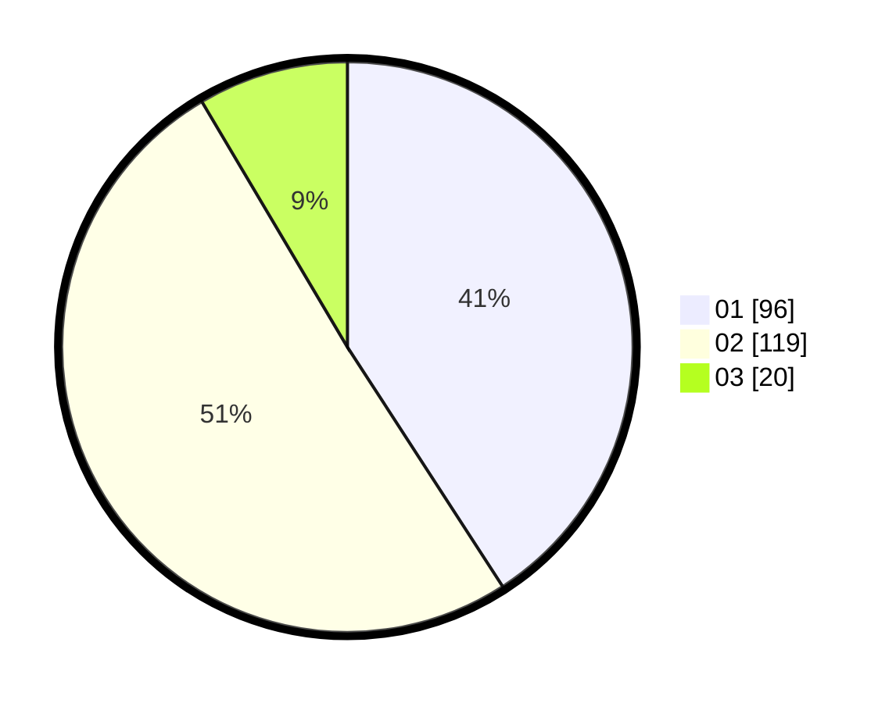

# Hasil

Hasil perolehan suara paslon dapat dilihat pada file paslon-01.txt, paslon-02.txt, dan paslon-03.txt.

Jika tidak ada, artinya data tersebut belum ada pada SIREKAP.

## Perolehan Suara

 * Paslon 01: **96**.
 * Paslon 02: **119**.
 * Paslon 03: **20**.

## Foto C Plano

https://sirekap-obj-formc.kpu.go.id/2bc6/pemilu/ppwp/31/75/10/10/08/3175101008002-20240214-195028--3d3600fe-2312-4b1a-af1f-3a494076ad88.jpg

https://sirekap-obj-formc.kpu.go.id/2bc6/pemilu/ppwp/31/75/10/10/08/3175101008002-20240214-195134--85702f25-221e-4765-89b0-035dc92c7e4e.jpg

https://sirekap-obj-formc.kpu.go.id/2bc6/pemilu/ppwp/31/75/10/10/08/3175101008002-20240214-195225--fd708951-fce5-4e0f-a9b5-b459f043bcbf.jpg
