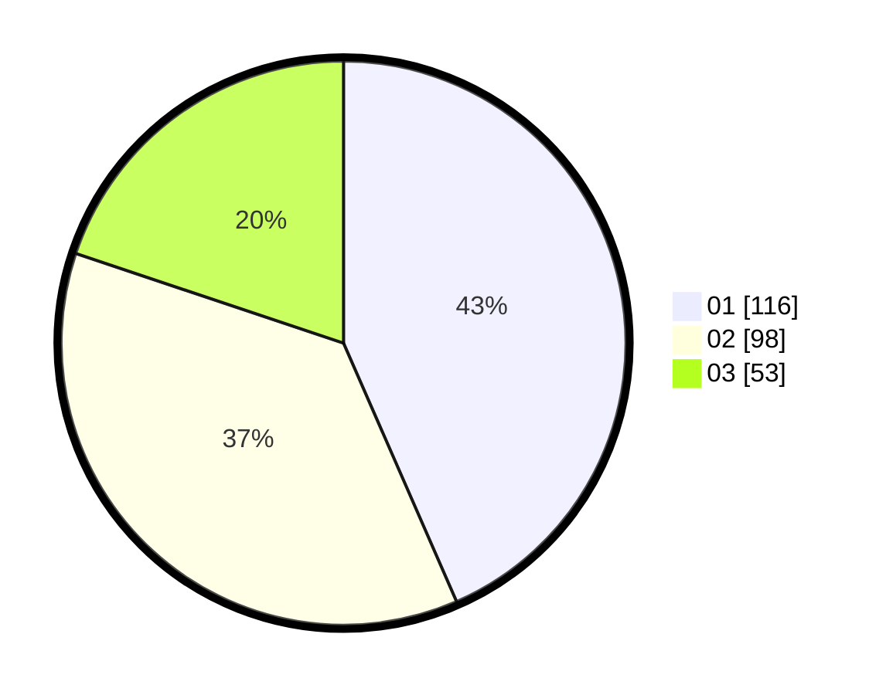

# Hasil

Hasil perolehan suara paslon dapat dilihat pada file paslon-01.txt, paslon-02.txt, dan paslon-03.txt.

Jika tidak ada, artinya data tersebut belum ada pada SIREKAP.

## Perolehan Suara

 * Paslon 01: **116**.
 * Paslon 02: **98**.
 * Paslon 03: **53**.

## Foto C Plano

https://sirekap-obj-formc.kpu.go.id/507c/pemilu/ppwp/31/75/10/10/08/3175101008004-20240214-225943--4517bd69-aeec-4046-8197-50b70d669016.jpg

https://sirekap-obj-formc.kpu.go.id/507c/pemilu/ppwp/31/75/10/10/08/3175101008004-20240214-230248--81d8e186-4f4f-481e-9cde-e2576bb7c272.jpg

https://sirekap-obj-formc.kpu.go.id/507c/pemilu/ppwp/31/75/10/10/08/3175101008004-20240214-230046--696e12d0-d786-49c5-b12d-4426c5a4401f.jpg
