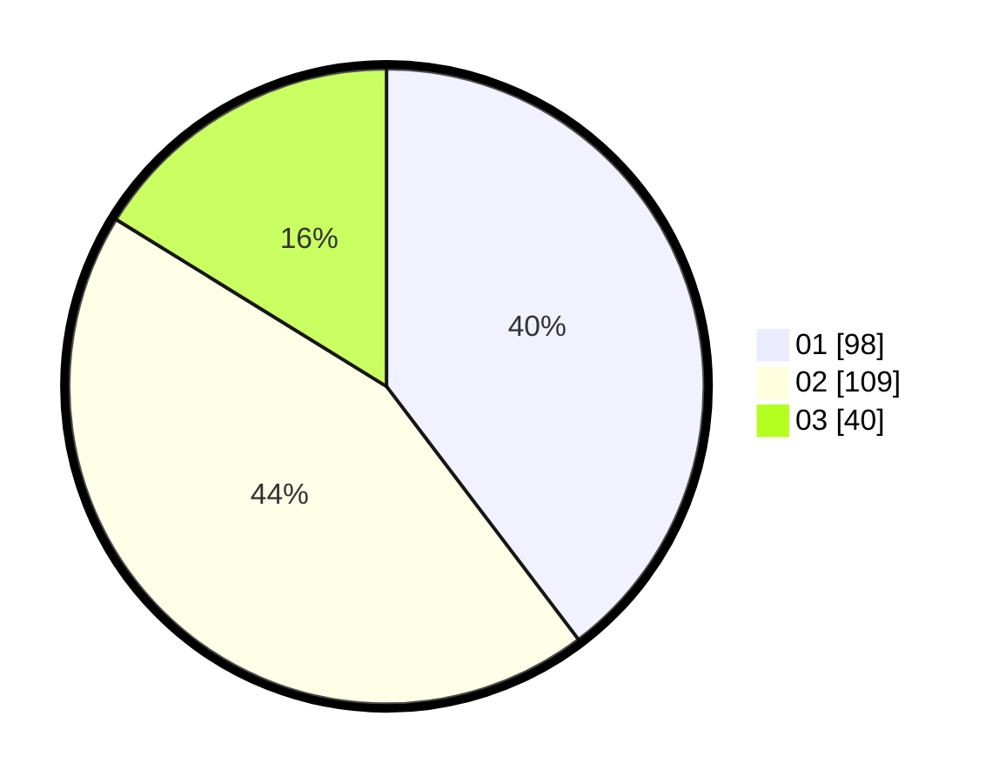

# Hasil

Hasil perolehan suara paslon dapat dilihat pada file paslon-01.txt, paslon-02.txt, dan paslon-03.txt.

Jika tidak ada, artinya data tersebut belum ada pada SIREKAP.

## Perolehan Suara

 * Paslon 01: **98**.
 * Paslon 02: **109**.
 * Paslon 03: **40**.

## Foto C Plano

https://sirekap-obj-formc.kpu.go.id/9393/pemilu/ppwp/31/75/10/10/08/3175101008008-20240214-224203--b1078600-968c-4c4c-86da-eadcfc3e46de.jpg

https://sirekap-obj-formc.kpu.go.id/9393/pemilu/ppwp/31/75/10/10/08/3175101008008-20240214-230259--b49a2eb2-3d75-4756-a475-41bd01724c5e.jpg

https://sirekap-obj-formc.kpu.go.id/9393/pemilu/ppwp/31/75/10/10/08/3175101008008-20240214-230415--1945ee05-d78f-4929-bffb-1eb55fc7c079.jpg
