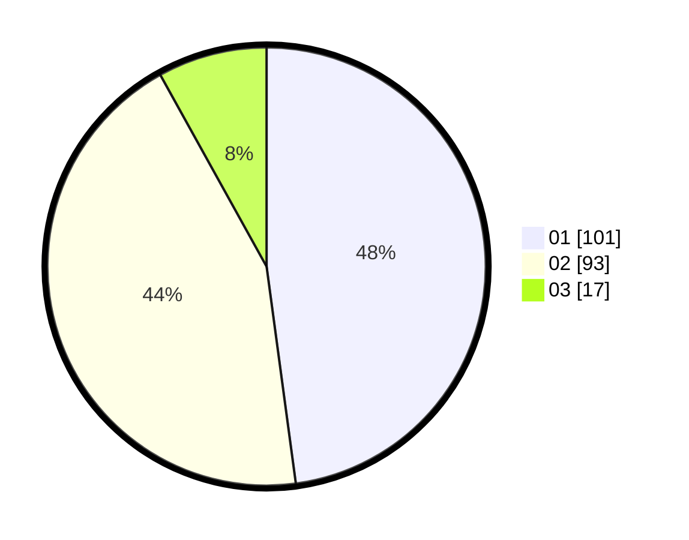

# Hasil

Hasil perolehan suara paslon dapat dilihat pada file paslon-01.txt, paslon-02.txt, dan paslon-03.txt.

Jika tidak ada, artinya data tersebut belum ada pada SIREKAP.

## Perolehan Suara

 * Paslon 01: **101**.
 * Paslon 02: **93**.
 * Paslon 03: **17**.

## Foto C Plano

https://sirekap-obj-formc.kpu.go.id/a6ca/pemilu/ppwp/31/75/10/10/08/3175101008010-20240214-201532--3083b5a3-34d1-4d5b-864a-50a9918ea8e2.jpg

https://sirekap-obj-formc.kpu.go.id/a6ca/pemilu/ppwp/31/75/10/10/08/3175101008010-20240214-201601--5bf864cd-09af-49cd-8b7b-0f405c9a47a9.jpg

https://sirekap-obj-formc.kpu.go.id/a6ca/pemilu/ppwp/31/75/10/10/08/3175101008010-20240214-201638--73fa8510-b20c-41fd-8e3a-438034d7ba47.jpg
