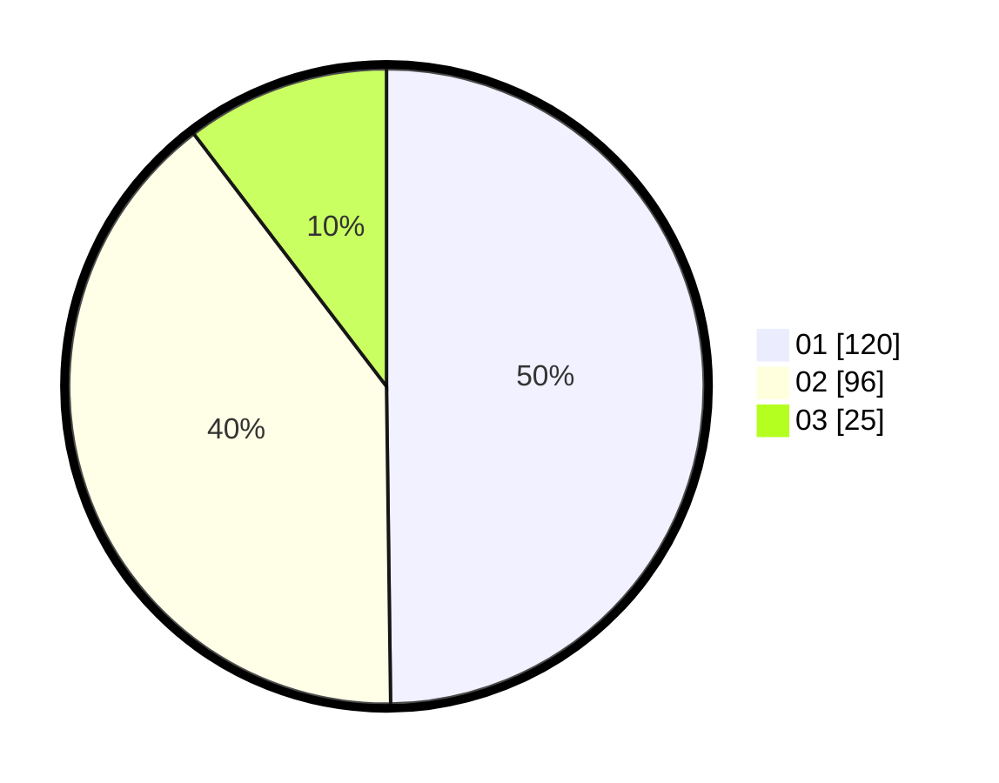

# Hasil

Hasil perolehan suara paslon dapat dilihat pada file paslon-01.txt, paslon-02.txt, dan paslon-03.txt.

Jika tidak ada, artinya data tersebut belum ada pada SIREKAP.

## Perolehan Suara

 * Paslon 01: **120**.
 * Paslon 02: **96**.
 * Paslon 03: **25**.

## Foto C Plano

https://sirekap-obj-formc.kpu.go.id/d4a5/pemilu/ppwp/31/75/10/10/08/3175101008022-20240214-223741--8ece1525-4783-4e9b-b306-ff5886ccf350.jpg

https://sirekap-obj-formc.kpu.go.id/d4a5/pemilu/ppwp/31/75/10/10/08/3175101008022-20240214-223731--85a78df7-929d-4ab7-a358-37335ebb012e.jpg

https://sirekap-obj-formc.kpu.go.id/d4a5/pemilu/ppwp/31/75/10/10/08/3175101008022-20240214-201122--8df7fe17-5ca3-4f98-bc37-b816beb17e9a.jpg
