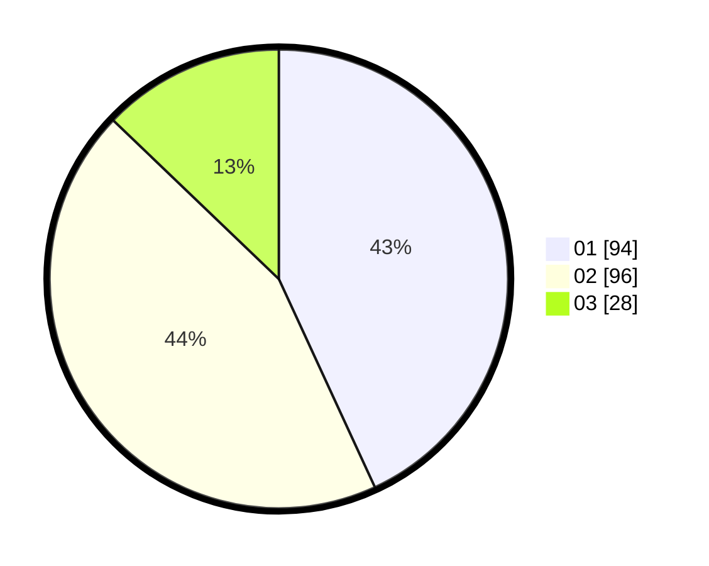

# Hasil

Hasil perolehan suara paslon dapat dilihat pada file paslon-01.txt, paslon-02.txt, dan paslon-03.txt.

Jika tidak ada, artinya data tersebut belum ada pada SIREKAP.

## Perolehan Suara

 * Paslon 01: **94**.
 * Paslon 02: **96**.
 * Paslon 03: **28**.

## Foto C Plano

https://sirekap-obj-formc.kpu.go.id/9334/pemilu/ppwp/31/75/10/10/08/3175101008026-20240214-195453--9e30eb48-4504-4b17-95e7-19715926f9d4.jpg

https://sirekap-obj-formc.kpu.go.id/9334/pemilu/ppwp/31/75/10/10/08/3175101008026-20240214-155849--837a8f38-da7b-485f-ac16-af0fe21b12dc.jpg

https://sirekap-obj-formc.kpu.go.id/9334/pemilu/ppwp/31/75/10/10/08/3175101008026-20240214-195656--9c6abba2-22c2-40e9-b7a2-6c44e8bedd73.jpg
