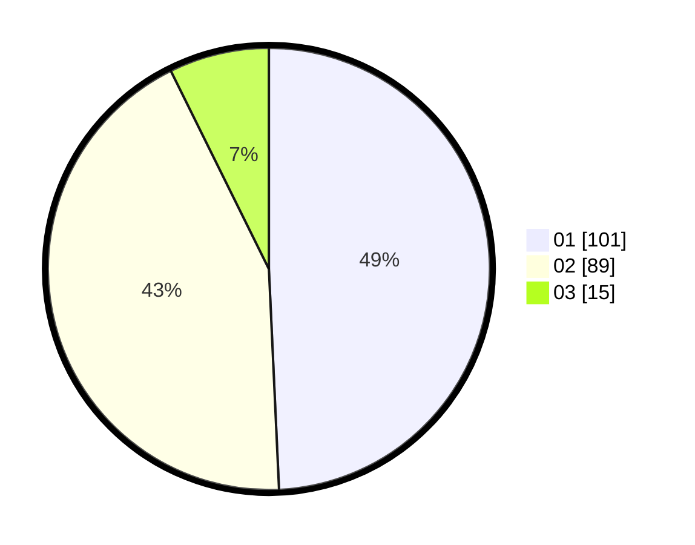

# Hasil

Hasil perolehan suara paslon dapat dilihat pada file paslon-01.txt, paslon-02.txt, dan paslon-03.txt.

Jika tidak ada, artinya data tersebut belum ada pada SIREKAP.

## Perolehan Suara

 * Paslon 01: **101**.
 * Paslon 02: **89**.
 * Paslon 03: **15**.

## Foto C Plano

https://sirekap-obj-formc.kpu.go.id/123c/pemilu/ppwp/31/75/10/10/08/3175101008044-20240214-190232--2bf3ef0b-2d42-4c5a-ab41-e29fb4f5f4f8.jpg

https://sirekap-obj-formc.kpu.go.id/123c/pemilu/ppwp/31/75/10/10/08/3175101008044-20240214-190247--008a6afd-b787-4994-8646-f5d47045e7e9.jpg

https://sirekap-obj-formc.kpu.go.id/123c/pemilu/ppwp/31/75/10/10/08/3175101008044-20240214-203352--09b65445-1728-448f-a6b4-97134dd01688.jpg

## DATA PEMILIH TETAP

Jumlah pemilih dalam DPT: **247**.
 * L: **109**.
 * P: **138**.

## DATA PENGGUNA HAK PILIH

Jumlah pengguna hak pilih dalam DPT: **200**.
 * L: **86**.
 * P: **114**.

Jumlah pengguna hak pilih dalam DPTb: **7**.
 * L: **1**.
 * P: **2**.

Jumlah pengguna hak pilih dalam DPK: **3**.
 * L: **0**.
 * P: **3**.

Jumlah pengguna hak pilih: **206**.
 * L: **87**.
 * P: **119**.

## JUMLAH SUARA SAH DAN TIDAK SAH

JUMLAH SELURUH SUARA SAH: **205**.

JUMLAH SUARA TIDAK SAH: **1**.

JUMLAH SELURUH SUARA SAH DAN SUARA TIDAK SAH: **206**.
