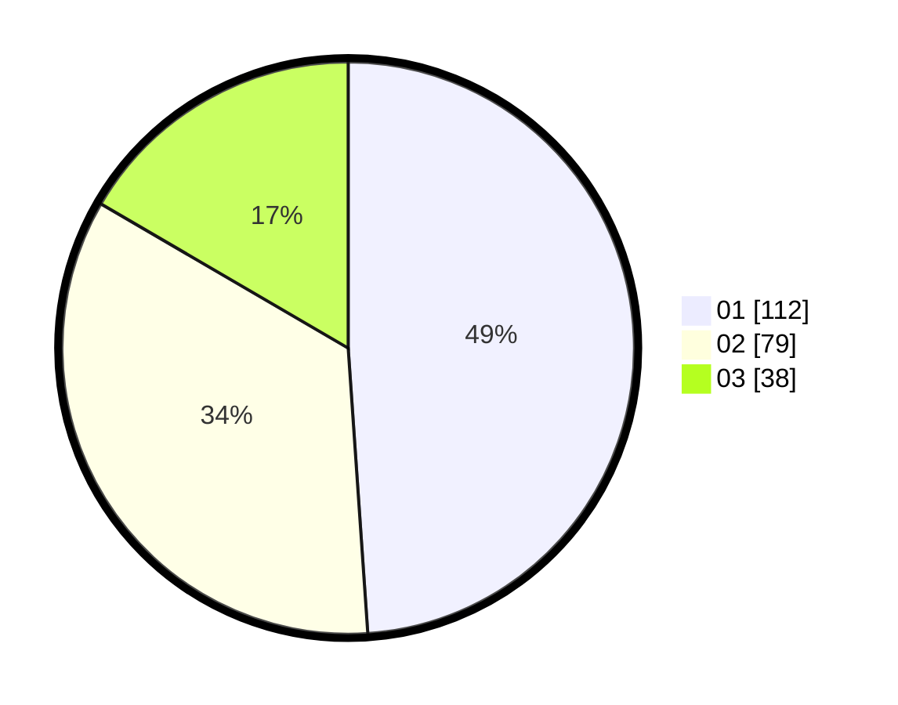

# Hasil

Hasil perolehan suara paslon dapat dilihat pada file paslon-01.txt, paslon-02.txt, dan paslon-03.txt.

Jika tidak ada, artinya data tersebut belum ada pada SIREKAP.

## Perolehan Suara

 * Paslon 01: **112**.
 * Paslon 02: **79**.
 * Paslon 03: **38**.

## Foto C Plano

https://sirekap-obj-formc.kpu.go.id/106f/pemilu/ppwp/31/75/10/10/08/3175101008051-20240215-033901--efef78b6-ff52-47c0-a85a-c4bf7364885b.jpg

https://sirekap-obj-formc.kpu.go.id/106f/pemilu/ppwp/31/75/10/10/08/3175101008051-20240214-155116--3023f331-a132-4778-80e5-0afe87e57b0b.jpg

https://sirekap-obj-formc.kpu.go.id/106f/pemilu/ppwp/31/75/10/10/08/3175101008051-20240214-155202--4ad68903-f3da-42af-909d-67379d2032b9.jpg

## DATA PEMILIH TETAP

Jumlah pemilih dalam DPT: **279**.
 * L: **140**.
 * P: **139**.

## DATA PENGGUNA HAK PILIH

Jumlah pengguna hak pilih dalam DPT: **234**.
 * L: **114**.
 * P: **120**.

Jumlah pengguna hak pilih dalam DPTb: **2**.
 * L: **1**.
 * P: **1**.

Jumlah pengguna hak pilih dalam DPK: **1**.
 * L: **0**.
 * P: **1**.

Jumlah pengguna hak pilih: **237**.
 * L: **115**.
 * P: **122**.

## JUMLAH SUARA SAH DAN TIDAK SAH

JUMLAH SELURUH SUARA SAH: **229**.

JUMLAH SUARA TIDAK SAH: **8**.

JUMLAH SELURUH SUARA SAH DAN SUARA TIDAK SAH: **237**.
