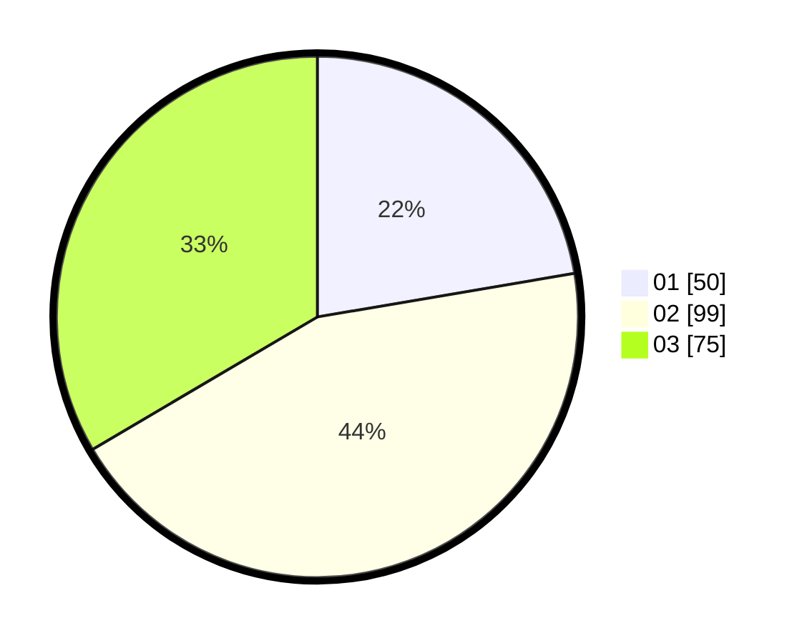

# Hasil

Hasil perolehan suara paslon dapat dilihat pada file paslon-01.txt, paslon-02.txt, dan paslon-03.txt.

Jika tidak ada, artinya data tersebut belum ada pada SIREKAP.

## Perolehan Suara

 * Paslon 01: **50**.
 * Paslon 02: **99**.
 * Paslon 03: **75**.

## Foto C Plano

https://sirekap-obj-formc.kpu.go.id/1b0f/pemilu/ppwp/31/75/10/10/08/3175101008058-20240214-201059--c9a61212-ad2e-47c2-8ef2-72f4f83ac90c.jpg

https://sirekap-obj-formc.kpu.go.id/1b0f/pemilu/ppwp/31/75/10/10/08/3175101008058-20240214-201307--418b681d-e8c8-4e66-9746-e346f169c040.jpg

https://sirekap-obj-formc.kpu.go.id/1b0f/pemilu/ppwp/31/75/10/10/08/3175101008058-20240214-201349--d372db83-6280-41ae-8c4f-682ef5565a87.jpg

## DATA PEMILIH TETAP

Jumlah pemilih dalam DPT: **279**.
 * L: **140**.
 * P: **139**.

## DATA PENGGUNA HAK PILIH

Jumlah pengguna hak pilih dalam DPT: **221**.
 * L: **103**.
 * P: **118**.

Jumlah pengguna hak pilih dalam DPTb: **5**.
 * L: **3**.
 * P: **2**.

Jumlah pengguna hak pilih dalam DPK: **0**.
 * L: **0**.
 * P: **0**.

Jumlah pengguna hak pilih: **226**.
 * L: **106**.
 * P: **120**.

## JUMLAH SUARA SAH DAN TIDAK SAH

JUMLAH SELURUH SUARA SAH: **224**.

JUMLAH SUARA TIDAK SAH: **2**.

JUMLAH SELURUH SUARA SAH DAN SUARA TIDAK SAH: **226**.
