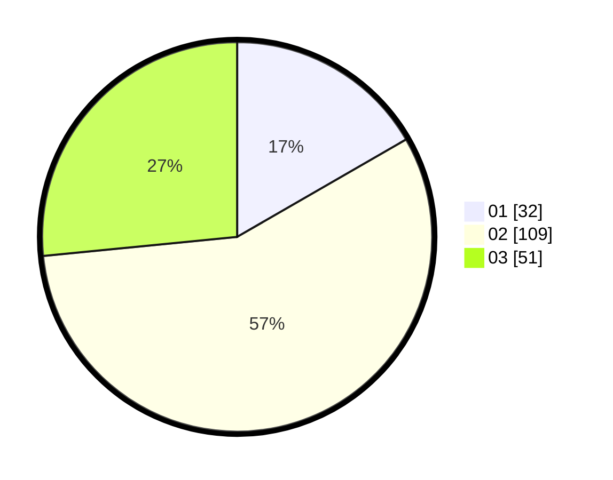

# Hasil

Hasil perolehan suara paslon dapat dilihat pada file paslon-01.txt, paslon-02.txt, dan paslon-03.txt.

Jika tidak ada, artinya data tersebut belum ada pada SIREKAP.

## Perolehan Suara

 * Paslon 01: **32**.
 * Paslon 02: **109**.
 * Paslon 03: **51**.

## Foto C Plano

https://sirekap-obj-formc.kpu.go.id/2686/pemilu/ppwp/31/75/10/10/08/3175101008059-20240214-215946--5426f0e4-447b-495e-a6cf-b8a5e05fa928.jpg

https://sirekap-obj-formc.kpu.go.id/2686/pemilu/ppwp/31/75/10/10/08/3175101008059-20240216-133538--9b88f22e-dec3-4e14-8fa2-ddeafd051015.jpg

https://sirekap-obj-formc.kpu.go.id/2686/pemilu/ppwp/31/75/10/10/08/3175101008059-20240216-133953--4f7121b1-b2fa-4dc7-8850-53024f2da97b.jpg

## DATA PEMILIH TETAP

Jumlah pemilih dalam DPT: **257**.
 * L: **117**.
 * P: **140**.

## DATA PENGGUNA HAK PILIH

Jumlah pengguna hak pilih dalam DPT: **191**.
 * L: **81**.
 * P: **110**.

Jumlah pengguna hak pilih dalam DPTb: **0**.
 * L: **0**.
 * P: **0**.

Jumlah pengguna hak pilih dalam DPK: **3**.
 * L: **3**.
 * P: **0**.

Jumlah pengguna hak pilih: **194**.
 * L: **84**.
 * P: **110**.

## JUMLAH SUARA SAH DAN TIDAK SAH

JUMLAH SELURUH SUARA SAH: **192**.

JUMLAH SUARA TIDAK SAH: **2**.

JUMLAH SELURUH SUARA SAH DAN SUARA TIDAK SAH: **194**.
