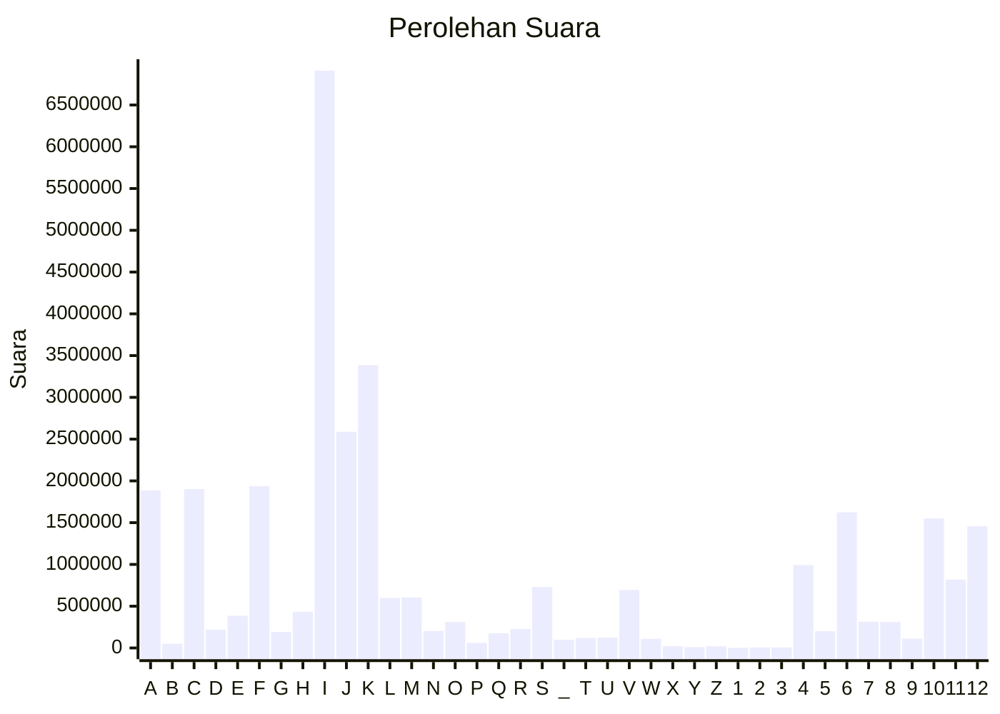

# Hasil

Paslon **H. ANIES RASYID BASWEDAN, Ph.D. - Dr. (H.C.) H. A. MUHAIMIN ISKANDAR**

## Grafik

## Tabel

| #  | Label | Kode Wilayah | Nama Wilayah              | Suara     | Suara (raw) | Persentase |
|:-- |:----- |:------------ |:------------------------- | ---------:| -----------:| ----------:|
| 1  | A     | 11           | ACEH                      | 1.885.991 | 1885991     | 6,01       |
| 2  | B     | 51           | BALI                      | 50.573    | 50573       | 0,16       |
| 3  | C     | 36           | BANTEN                    | 1.902.047 | 1902047     | 6,06       |
| 4  | D     | 17           | BENGKULU                  | 218.396   | 218396      | 0,70       |
| 5  | E     | 34           | DI YOGYAKARTA             | 385.680   | 385680      | 1,23       |
| 6  | F     | 31           | DKI JAKARTA               | 1.936.408 | 1936408     | 6,17       |
| 7  | G     | 75           | GORONTALO                 | 192.164   | 192164      | 0,61       |
| 8  | H     | 15           | JAMBI                     | 433.738   | 433738      | 1,38       |
| 9  | I     | 32           | JAWA BARAT                | 6.912.038 | 6912038     | 22,02      |
| 10 | J     | 33           | JAWA TENGAH               | 2.588.048 | 2588048     | 8,25       |
| 11 | K     | 35           | JAWA TIMUR                | 3.385.341 | 3385341     | 10,79      |
| 12 | L     | 61           | KALIMANTAN BARAT          | 598.791   | 598791      | 1,91       |
| 13 | M     | 63           | KALIMANTAN SELATAN        | 605.019   | 605019      | 1,93       |
| 14 | N     | 62           | KALIMANTAN TENGAH         | 203.258   | 203258      | 0,65       |
| 15 | O     | 64           | KALIMANTAN TIMUR          | 310.097   | 310097      | 0,99       |
| 16 | P     | 65           | KALIMANTAN UTARA          | 60.399    | 60399       | 0,19       |
| 17 | Q     | 19           | KEPULAUAN BANGKA BELITUNG | 175.200   | 175200      | 0,56       |
| 18 | R     | 21           | KEPULAUAN RIAU            | 227.420   | 227420      | 0,72       |
| 19 | S     | 18           | LAMPUNG                   | 729.032   | 729032      | 2,32       |
| 20 | _     | 99           | Luar Negeri               | 97.822    | 97822       | 0,31       |
| 21 | T     | 81           | MALUKU                    | 120.346   | 120346      | 0,38       |
| 22 | U     | 82           | MALUKU UTARA              | 122.897   | 122897      | 0,39       |
| 23 | V     | 52           | NUSA TENGGARA BARAT       | 694.839   | 694839      | 2,21       |
| 24 | W     | 53           | NUSA TENGGARA TIMUR       | 109.567   | 109567      | 0,35       |
| 25 | X     | 91           | PAPUA                     | 21.277    | 21277       | 0,07       |
| 26 | Y     | 92           | PAPUA BARAT               | 9.905     | 9905        | 0,03       |
| 27 | Z     | 96           | PAPUA BARAT DAYA          | 20.885    | 20885       | 0,07       |
| 28 | 1     | 95           | PAPUA PEGUNUNGAN          | 145       | 145         | 0,00       |
| 29 | 2     | 93           | PAPUA SELATAN             | 6.167     | 6167        | 0,02       |
| 30 | 3     | 94           | PAPUA TENGAH              | 6.312     | 6312        | 0,02       |
| 31 | 4     | 14           | RIAU                      | 991.827   | 991827      | 3,16       |
| 32 | 5     | 76           | SULAWESI BARAT            | 200.900   | 200900      | 0,64       |
| 33 | 6     | 73           | SULAWESI SELATAN          | 1.623.169 | 1623169     | 5,17       |
| 34 | 7     | 72           | SULAWESI TENGAH           | 312.976   | 312976      | 1,00       |
| 35 | 8     | 74           | SULAWESI TENGGARA         | 310.133   | 310133      | 0,99       |
| 36 | 9     | 71           | SULAWESI UTARA            | 111.669   | 111669      | 0,36       |
| 37 | 10    | 13           | SUMATERA BARAT            | 1.549.933 | 1549933     | 4,94       |
| 38 | 11    | 16           | SUMATERA SELATAN          | 819.167   | 819167      | 2,61       |
| 39 | 12    | 12           | SUMATERA UTARA            | 1.457.685 | 1457685     | 4,64       |

