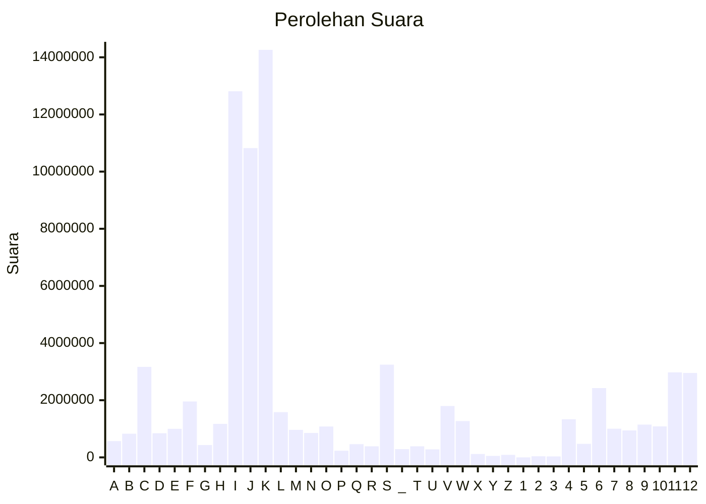

# Hasil

Paslon **H. PRABOWO SUBIANTO - GIBRAN RAKABUMING RAKA**

## Grafik

## Tabel

| #  | Label | Kode Wilayah | Nama Wilayah              | Suara      | Suara (raw) | Persentase |
|:-- |:----- |:------------ |:------------------------- | ----------:| -----------:| ----------:|
| 1  | A     | 11           | ACEH                      | 570.090    | 570090      | 0,76       |
| 2  | B     | 51           | BALI                      | 828.108    | 828108      | 1,10       |
| 3  | C     | 36           | BANTEN                    | 3.168.004  | 3168004     | 4,20       |
| 4  | D     | 17           | BENGKULU                  | 844.549    | 844549      | 1,12       |
| 5  | E     | 34           | DI YOGYAKARTA             | 1.000.797  | 1000797     | 1,33       |
| 6  | F     | 31           | DKI JAKARTA               | 1.956.503  | 1956503     | 2,60       |
| 7  | G     | 75           | GORONTALO                 | 432.164    | 432164      | 0,57       |
| 8  | H     | 15           | JAMBI                     | 1.174.491  | 1174491     | 1,56       |
| 9  | I     | 32           | JAWA BARAT                | 12.810.641 | 12810641    | 17,00      |
| 10 | J     | 33           | JAWA TENGAH               | 10.823.685 | 10823685    | 14,36      |
| 11 | K     | 35           | JAWA TIMUR                | 14.261.802 | 14261802    | 18,92      |
| 12 | L     | 61           | KALIMANTAN BARAT          | 1.583.169  | 1583169     | 2,10       |
| 13 | M     | 63           | KALIMANTAN SELATAN        | 962.605    | 962605      | 1,28       |
| 14 | N     | 62           | KALIMANTAN TENGAH         | 852.749    | 852749      | 1,13       |
| 15 | O     | 64           | KALIMANTAN TIMUR          | 1.080.494  | 1080494     | 1,43       |
| 16 | P     | 65           | KALIMANTAN UTARA          | 232.549    | 232549      | 0,31       |
| 17 | Q     | 19           | KEPULAUAN BANGKA BELITUNG | 462.503    | 462503      | 0,61       |
| 18 | R     | 21           | KEPULAUAN RIAU            | 388.160    | 388160      | 0,51       |
| 19 | S     | 18           | LAMPUNG                   | 3.244.965  | 3244965     | 4,30       |
| 20 | _     | 99           | Luar Negeri               | 288.453    | 288453      | 0,38       |
| 21 | T     | 81           | MALUKU                    | 388.411    | 388411      | 0,52       |
| 22 | U     | 82           | MALUKU UTARA              | 281.423    | 281423      | 0,37       |
| 23 | V     | 52           | NUSA TENGGARA BARAT       | 1.798.838  | 1798838     | 2,39       |
| 24 | W     | 53           | NUSA TENGGARA TIMUR       | 1.270.866  | 1270866     | 1,69       |
| 25 | X     | 91           | PAPUA                     | 118.204    | 118204      | 0,16       |
| 26 | Y     | 92           | PAPUA BARAT               | 51.524     | 51524       | 0,07       |
| 27 | Z     | 96           | PAPUA BARAT DAYA          | 89.480     | 89480       | 0,12       |
| 28 | 1     | 95           | PAPUA PEGUNUNGAN          | 439        | 439         | 0,00       |
| 29 | 2     | 93           | PAPUA SELATAN             | 40.093     | 40093       | 0,05       |
| 30 | 3     | 94           | PAPUA TENGAH              | 34.070     | 34070       | 0,05       |
| 31 | 4     | 14           | RIAU                      | 1.334.849  | 1334849     | 1,77       |
| 32 | 5     | 76           | SULAWESI BARAT            | 474.371    | 474371      | 0,63       |
| 33 | 6     | 73           | SULAWESI SELATAN          | 2.425.217  | 2425217     | 3,22       |
| 34 | 7     | 72           | SULAWESI TENGAH           | 1.003.346  | 1003346     | 1,33       |
| 35 | 8     | 74           | SULAWESI TENGGARA         | 942.354    | 942354      | 1,25       |
| 36 | 9     | 71           | SULAWESI UTARA            | 1.146.484  | 1146484     | 1,52       |
| 37 | 10    | 13           | SUMATERA BARAT            | 1.084.147  | 1084147     | 1,44       |
| 38 | 11    | 16           | SUMATERA SELATAN          | 2.974.414  | 2974414     | 3,95       |
| 39 | 12    | 12           | SUMATERA UTARA            | 2.952.715  | 2952715     | 3,92       |

