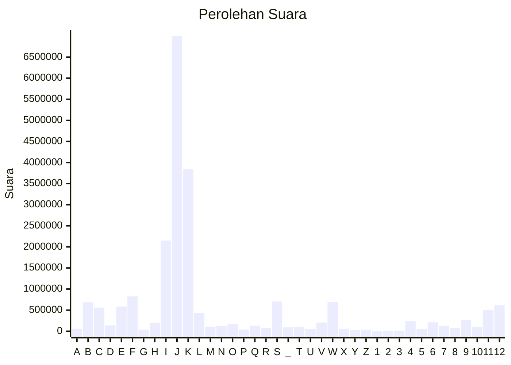

# Hasil

Paslon **H. GANJAR PRANOWO, S.H., M.I.P. - Prof. Dr. H. M. MAHFUD MD**

## Grafik

## Tabel

| #  | Label | Kode Wilayah | Nama Wilayah              | Suara     | Suara (raw) | Persentase |
|:-- |:----- |:------------ |:------------------------- | ---------:| -----------:| ----------:|
| 1  | A     | 11           | ACEH                      | 57.148    | 57148       | 0,27       |
| 2  | B     | 51           | BALI                      | 686.109   | 686109      | 3,21       |
| 3  | C     | 36           | BANTEN                    | 560.277   | 560277      | 2,62       |
| 4  | D     | 17           | BENGKULU                  | 140.187   | 140187      | 0,66       |
| 5  | E     | 34           | DI YOGYAKARTA             | 585.930   | 585930      | 2,74       |
| 6  | F     | 31           | DKI JAKARTA               | 824.937   | 824937      | 3,86       |
| 7  | G     | 75           | GORONTALO                 | 35.974    | 35974       | 0,17       |
| 8  | H     | 15           | JAMBI                     | 195.492   | 195492      | 0,91       |
| 9  | I     | 32           | JAWA BARAT                | 2.150.429 | 2150429     | 10,06      |
| 10 | J     | 33           | JAWA TENGAH               | 6.998.085 | 6998085     | 32,74      |
| 11 | K     | 35           | JAWA TIMUR                | 3.840.728 | 3840728     | 17,97      |
| 12 | L     | 61           | KALIMANTAN BARAT          | 431.961   | 431961      | 2,02       |
| 13 | M     | 63           | KALIMANTAN SELATAN        | 109.932   | 109932      | 0,51       |
| 14 | N     | 62           | KALIMANTAN TENGAH         | 126.801   | 126801      | 0,59       |
| 15 | O     | 64           | KALIMANTAN TIMUR          | 167.301   | 167301      | 0,78       |
| 16 | P     | 65           | KALIMANTAN UTARA          | 40.646    | 40646       | 0,19       |
| 17 | Q     | 19           | KEPULAUAN BANGKA BELITUNG | 133.313   | 133313      | 0,62       |
| 18 | R     | 21           | KEPULAUAN RIAU            | 81.829    | 81829       | 0,38       |
| 19 | S     | 18           | LAMPUNG                   | 705.725   | 705725      | 3,30       |
| 20 | _     | 99           | Luar Negeri               | 94.712    | 94712       | 0,44       |
| 21 | T     | 81           | MALUKU                    | 104.881   | 104881      | 0,49       |
| 22 | U     | 82           | MALUKU UTARA              | 57.893    | 57893       | 0,27       |
| 23 | V     | 52           | NUSA TENGGARA BARAT       | 207.011   | 207011      | 0,97       |
| 24 | W     | 53           | NUSA TENGGARA TIMUR       | 687.475   | 687475      | 3,22       |
| 25 | X     | 91           | PAPUA                     | 58.858    | 58858       | 0,28       |
| 26 | Y     | 92           | PAPUA BARAT               | 25.072    | 25072       | 0,12       |
| 27 | Z     | 96           | PAPUA BARAT DAYA          | 35.723    | 35723       | 0,17       |
| 28 | 1     | 95           | PAPUA PEGUNUNGAN          | 141       | 141         | 0,00       |
| 29 | 2     | 93           | PAPUA SELATAN             | 11.562    | 11562       | 0,05       |
| 30 | 3     | 94           | PAPUA TENGAH              | 15.143    | 15143       | 0,07       |
| 31 | 4     | 14           | RIAU                      | 243.067   | 243067      | 1,14       |
| 32 | 5     | 76           | SULAWESI BARAT            | 55.566    | 55566       | 0,26       |
| 33 | 6     | 73           | SULAWESI SELATAN          | 210.184   | 210184      | 0,98       |
| 34 | 7     | 72           | SULAWESI TENGAH           | 128.907   | 128907      | 0,60       |
| 35 | 8     | 74           | SULAWESI TENGGARA         | 79.411    | 79411       | 0,37       |
| 36 | 9     | 71           | SULAWESI UTARA            | 264.978   | 264978      | 1,24       |
| 37 | 10    | 13           | SUMATERA BARAT            | 107.860   | 107860      | 0,50       |
| 38 | 11    | 16           | SUMATERA SELATAN          | 498.493   | 498493      | 2,33       |
| 39 | 12    | 12           | SUMATERA UTARA            | 616.136   | 616136      | 2,88       |

