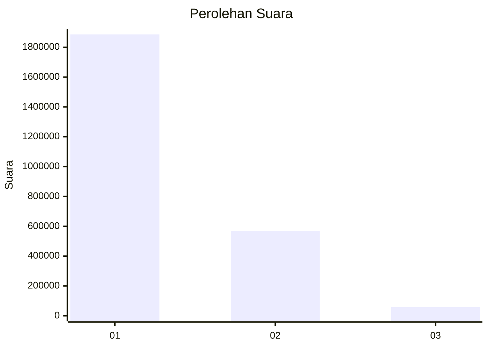
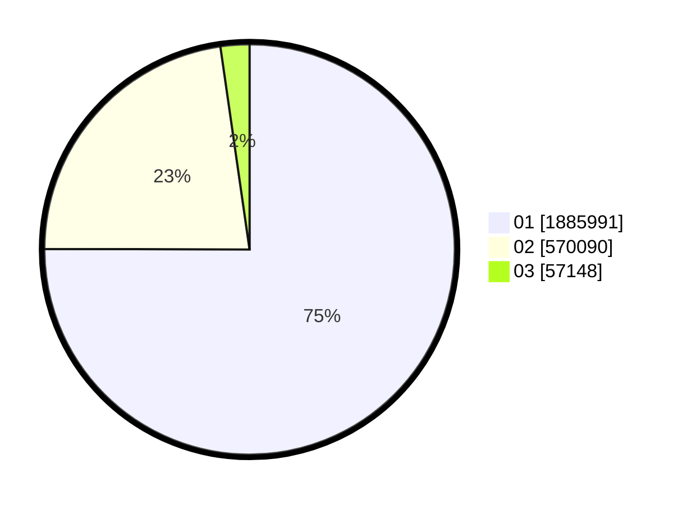

# Hasil

Wilayah **ACEH**

## Grafik

## Tabel

| No. | Nama Paslon    | Suara     | Suara (raw) | Persentase |
|:--- |:-------------- | ---------:| -----------:| ----------:|
| 1   | ANIES MUHAIMIN | 1.885.991 | 1885991     | 75,04      |
| 2   | PRABOWO GIBRAN | 570.090   | 570090      | 22,68      |
| 3   | GANJAR MAHFUD  | 57.148    | 57148       | 2,27       |

## Metadata

| Key             | Value   |
| --------------- | ------- |
| Tipe Pemilu     | Reguler |
| Persentase      | 78,81   |
| Status Progress | On      |

