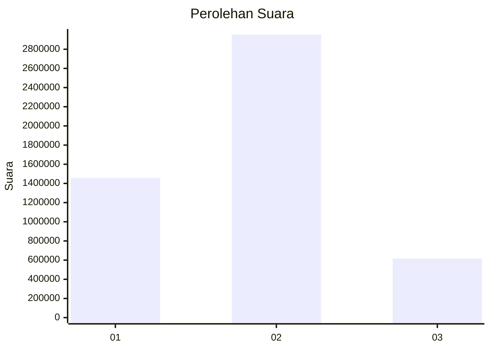
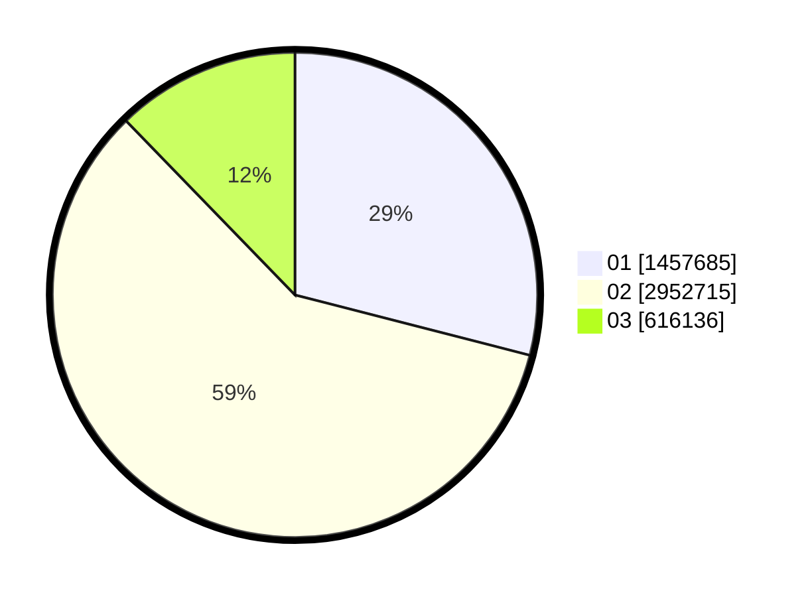

# Hasil

Wilayah **SUMATERA UTARA**

## Grafik

## Tabel

| No. | Nama Paslon    | Suara     | Suara (raw) | Persentase |
|:--- |:-------------- | ---------:| -----------:| ----------:|
| 1   | ANIES MUHAIMIN | 1.457.685 | 1457685     | 29,00      |
| 2   | PRABOWO GIBRAN | 2.952.715 | 2952715     | 58,74      |
| 3   | GANJAR MAHFUD  | 616.136   | 616136      | 12,26      |

## Metadata

| Key             | Value   |
| --------------- | ------- |
| Tipe Pemilu     | Reguler |
| Persentase      | 61,48   |
| Status Progress | On      |

