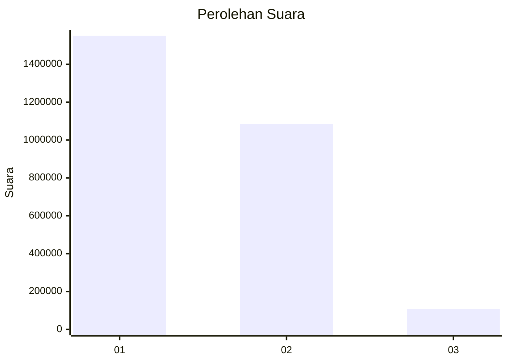
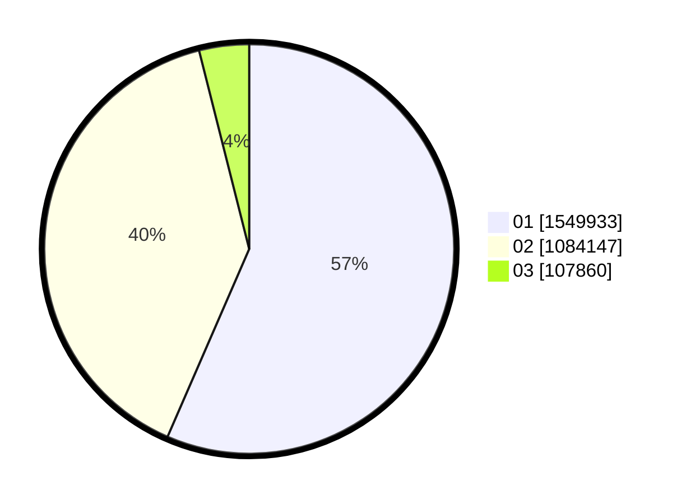

# Hasil

Wilayah **SUMATERA BARAT**

## Grafik

## Tabel

| No. | Nama Paslon    | Suara     | Suara (raw) | Persentase |
|:--- |:-------------- | ---------:| -----------:| ----------:|
| 1   | ANIES MUHAIMIN | 1.549.933 | 1549933     | 56,53      |
| 2   | PRABOWO GIBRAN | 1.084.147 | 1084147     | 39,54      |
| 3   | GANJAR MAHFUD  | 107.860   | 107860      | 3,93       |

## Metadata

| Key             | Value   |
| --------------- | ------- |
| Tipe Pemilu     | Reguler |
| Persentase      | 92,04   |
| Status Progress | On      |

