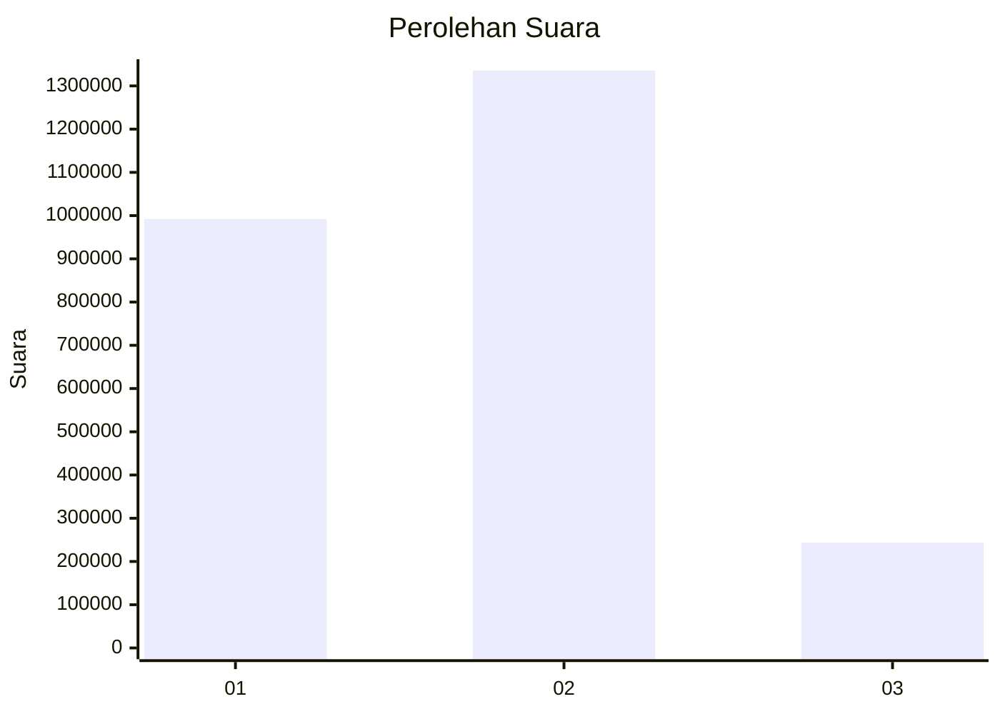

# Hasil

Wilayah **RIAU**

## Grafik

## Tabel

| No. | Nama Paslon    | Suara     | Suara (raw) | Persentase |
|:--- |:-------------- | ---------:| -----------:| ----------:|
| 1   | ANIES MUHAIMIN | 991.941   | 991941      | 38,59      |
| 2   | PRABOWO GIBRAN | 1.335.412 | 1335412     | 51,95      |
| 3   | GANJAR MAHFUD  | 243.185   | 243185      | 9,46       |

## Metadata

| Key             | Value   |
| --------------- | ------- |
| Tipe Pemilu     | Reguler |
| Persentase      | 68,35   |
| Status Progress | On      |

