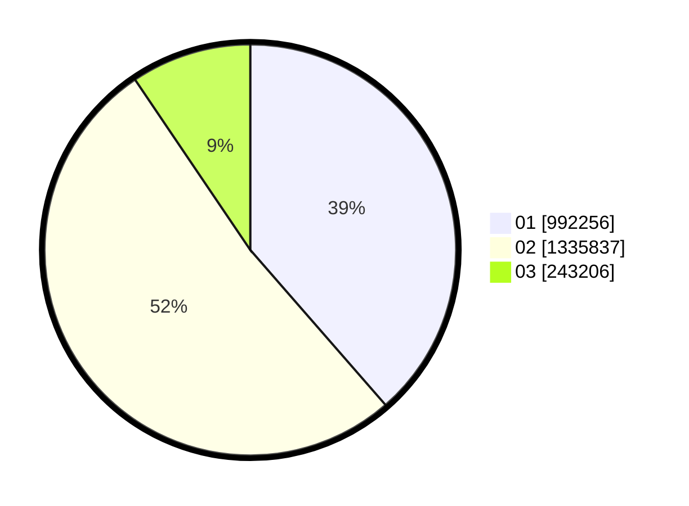

# Hasil

Wilayah **RIAU**

## Grafik

## Tabel

| No. | Nama Paslon    | Suara     | Suara (raw) | Persentase |
|:--- |:-------------- | ---------:| -----------:| ----------:|
| 1   | ANIES MUHAIMIN | 992.256   | 992256      | 38,59      |
| 2   | PRABOWO GIBRAN | 1.335.837 | 1335837     | 51,95      |
| 3   | GANJAR MAHFUD  | 243.206   | 243206      | 9,46       |

## Metadata

| Key             | Value   |
| --------------- | ------- |
| Tipe Pemilu     | Reguler |
| Persentase      | 68,53   |
| Status Progress | On      |

