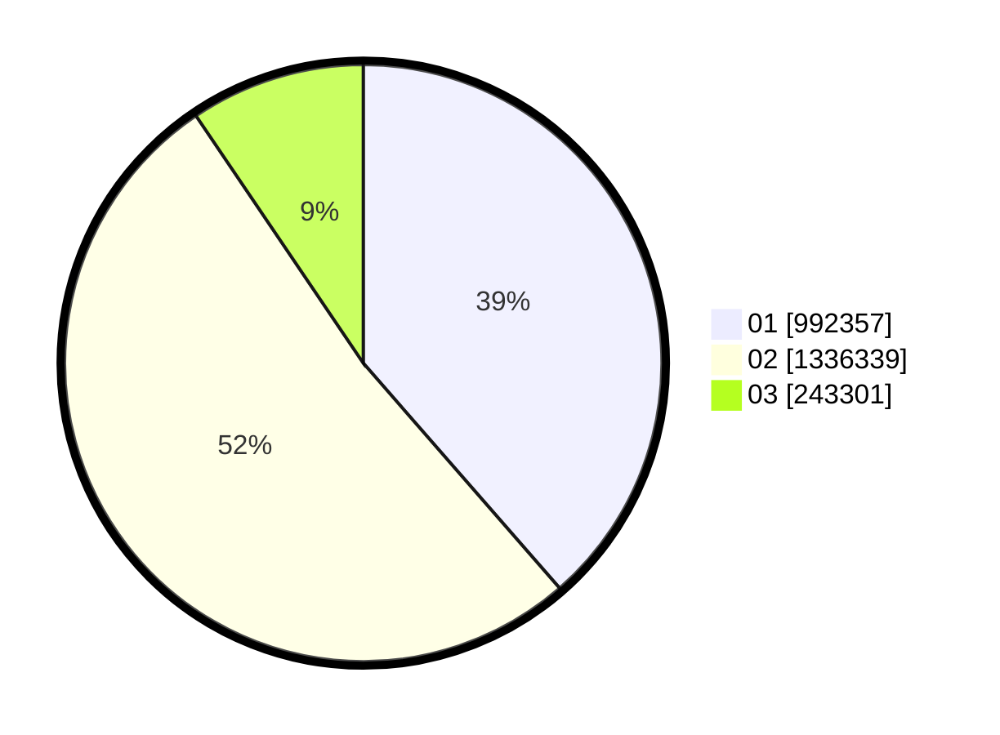

# Hasil

Wilayah **RIAU**

## Grafik

## Tabel

| No. | Nama Paslon    | Suara     | Suara (raw) | Persentase |
|:--- |:-------------- | ---------:| -----------:| ----------:|
| 1   | ANIES MUHAIMIN | 992.357   | 992357      | 38,58      |
| 2   | PRABOWO GIBRAN | 1.336.339 | 1336339     | 51,96      |
| 3   | GANJAR MAHFUD  | 243.301   | 243301      | 9,46       |

## Metadata

| Key             | Value   |
| --------------- | ------- |
| Tipe Pemilu     | Reguler |
| Persentase      | 68,51   |
| Status Progress | On      |

