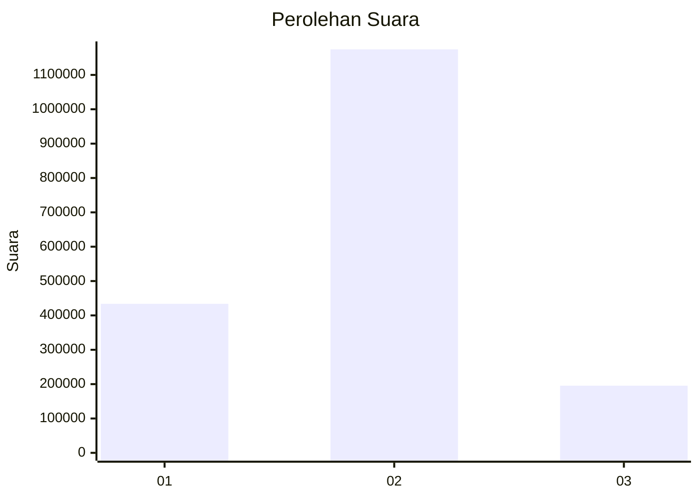
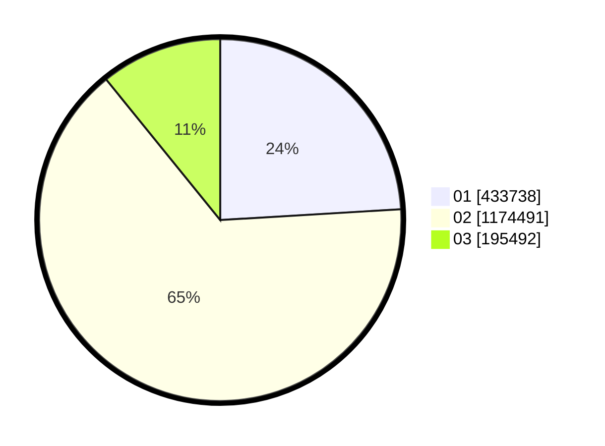

# Hasil

Wilayah **JAMBI**

## Grafik

## Tabel

| No. | Nama Paslon    | Suara     | Suara (raw) | Persentase |
|:--- |:-------------- | ---------:| -----------:| ----------:|
| 1   | ANIES MUHAIMIN | 433.738   | 433738      | 24,05      |
| 2   | PRABOWO GIBRAN | 1.174.491 | 1174491     | 65,11      |
| 3   | GANJAR MAHFUD  | 195.492   | 195492      | 10,84      |

## Metadata

| Key             | Value   |
| --------------- | ------- |
| Tipe Pemilu     | Reguler |
| Persentase      | 81,90   |
| Status Progress | On      |

