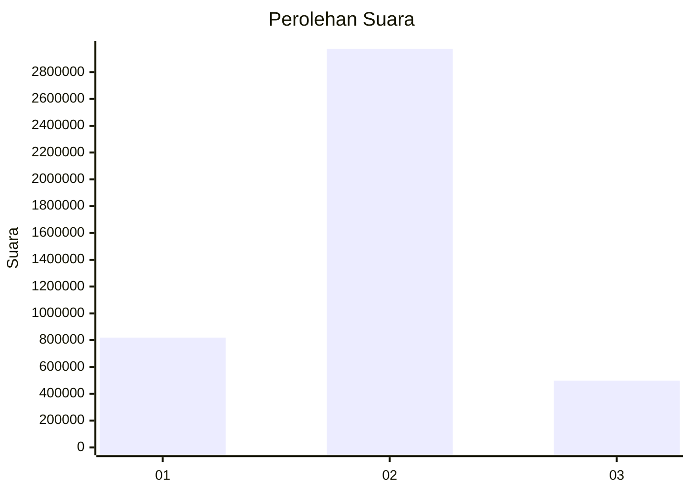
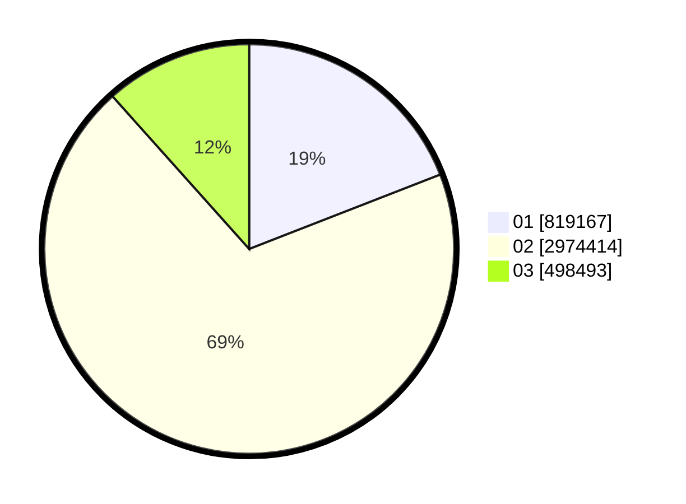

# Hasil

Wilayah **SUMATERA SELATAN**

## Grafik

## Tabel

| No. | Nama Paslon    | Suara     | Suara (raw) | Persentase |
|:--- |:-------------- | ---------:| -----------:| ----------:|
| 1   | ANIES MUHAIMIN | 819.167   | 819167      | 19,09      |
| 2   | PRABOWO GIBRAN | 2.974.414 | 2974414     | 69,30      |
| 3   | GANJAR MAHFUD  | 498.493   | 498493      | 11,61      |

## Metadata

| Key             | Value   |
| --------------- | ------- |
| Tipe Pemilu     | Reguler |
| Persentase      | 82,74   |
| Status Progress | On      |

