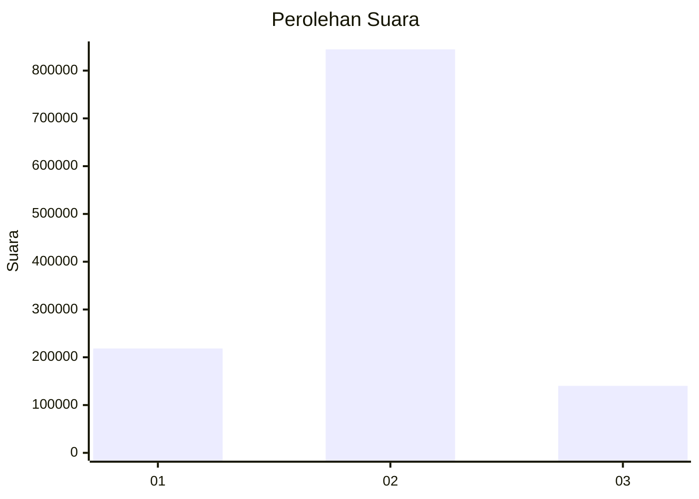
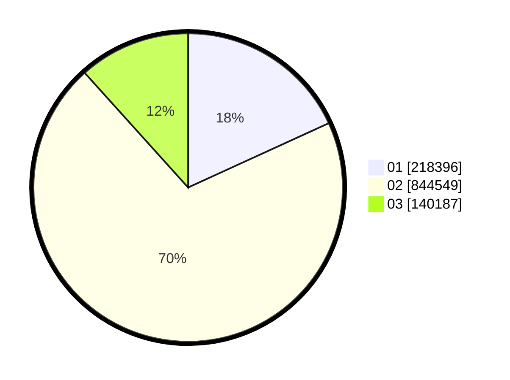

# Hasil

Wilayah **BENGKULU**

## Grafik

## Tabel

| No. | Nama Paslon    | Suara   | Suara (raw) | Persentase |
|:--- |:-------------- | -------:| -----------:| ----------:|
| 1   | ANIES MUHAIMIN | 218.396 | 218396      | 18,15      |
| 2   | PRABOWO GIBRAN | 844.549 | 844549      | 70,20      |
| 3   | GANJAR MAHFUD  | 140.187 | 140187      | 11,65      |

## Metadata

| Key             | Value   |
| --------------- | ------- |
| Tipe Pemilu     | Reguler |
| Persentase      | 94,40   |
| Status Progress | On      |

