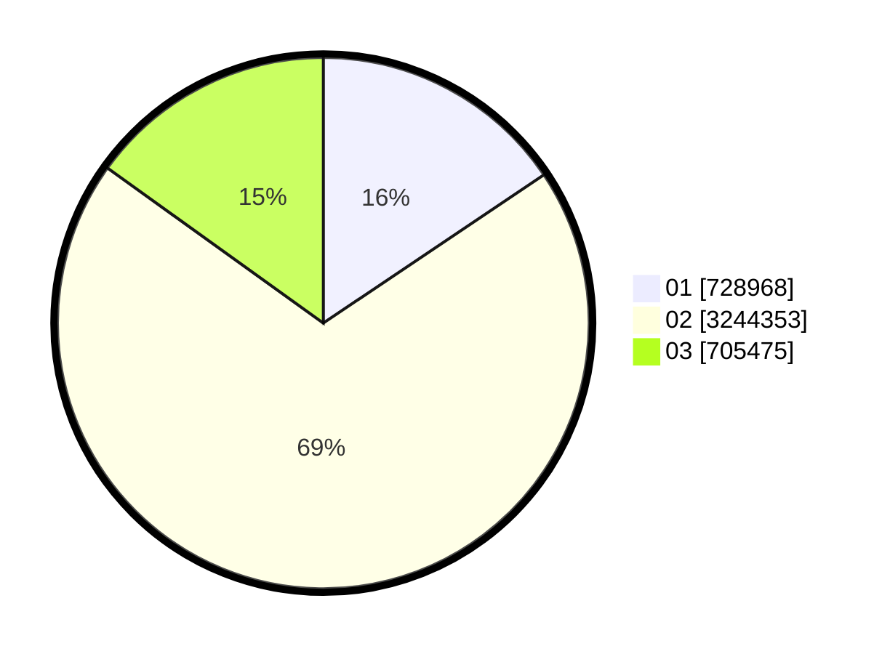

# Hasil

Wilayah **LAMPUNG**

## Grafik

## Tabel

| No. | Nama Paslon    | Suara     | Suara (raw) | Persentase |
|:--- |:-------------- | ---------:| -----------:| ----------:|
| 1   | ANIES MUHAIMIN | 728.968   | 728968      | 15,58      |
| 2   | PRABOWO GIBRAN | 3.244.353 | 3244353     | 69,34      |
| 3   | GANJAR MAHFUD  | 705.475   | 705475      | 15,08      |

## Metadata

| Key             | Value   |
| --------------- | ------- |
| Tipe Pemilu     | Reguler |
| Persentase      | 93,79   |
| Status Progress | On      |

