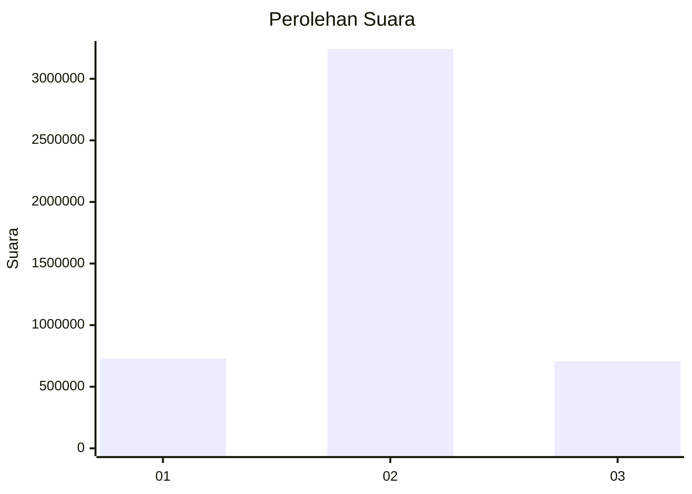

# Hasil

Wilayah **LAMPUNG**

## Grafik

## Tabel

| No. | Nama Paslon    | Suara     | Suara (raw) | Persentase |
|:--- |:-------------- | ---------:| -----------:| ----------:|
| 1   | ANIES MUHAIMIN | 728.762   | 728762      | 15,58      |
| 2   | PRABOWO GIBRAN | 3.243.232 | 3243232     | 69,34      |
| 3   | GANJAR MAHFUD  | 705.320   | 705320      | 15,08      |

## Metadata

| Key             | Value   |
| --------------- | ------- |
| Tipe Pemilu     | Reguler |
| Persentase      | 93,85   |
| Status Progress | On      |

