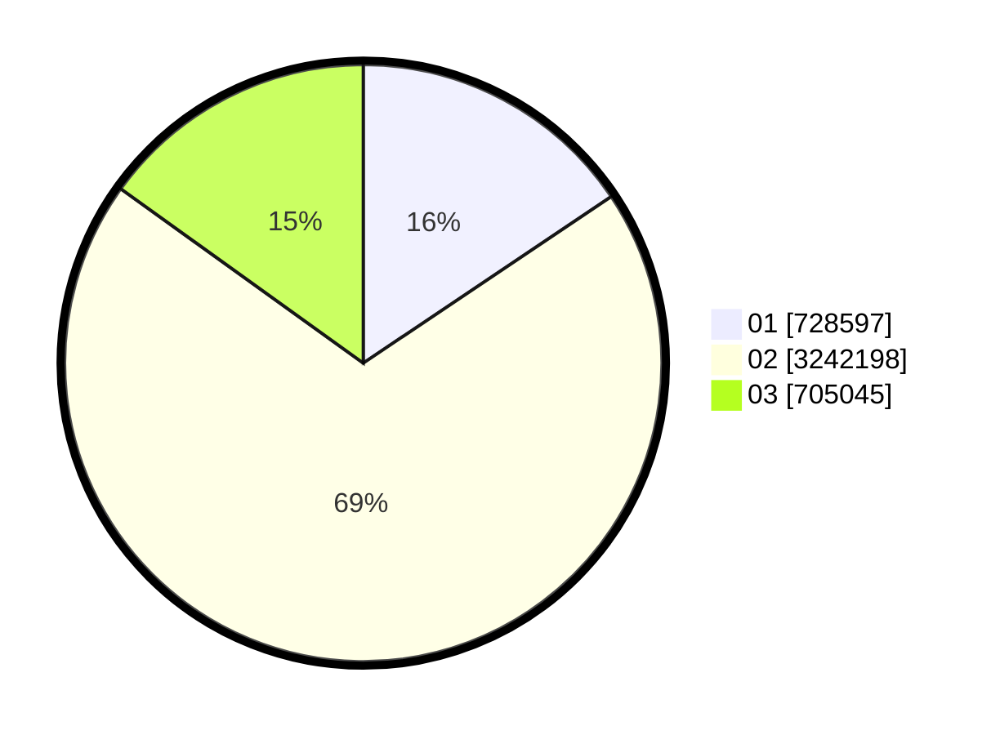

# Hasil

Wilayah **LAMPUNG**

## Grafik

## Tabel

| No. | Nama Paslon    | Suara     | Suara (raw) | Persentase |
|:--- |:-------------- | ---------:| -----------:| ----------:|
| 1   | ANIES MUHAIMIN | 728.597   | 728597      | 15,58      |
| 2   | PRABOWO GIBRAN | 3.242.198 | 3242198     | 69,34      |
| 3   | GANJAR MAHFUD  | 705.045   | 705045      | 15,08      |

## Metadata

| Key             | Value   |
| --------------- | ------- |
| Tipe Pemilu     | Reguler |
| Persentase      | 94,02   |
| Status Progress | On      |

