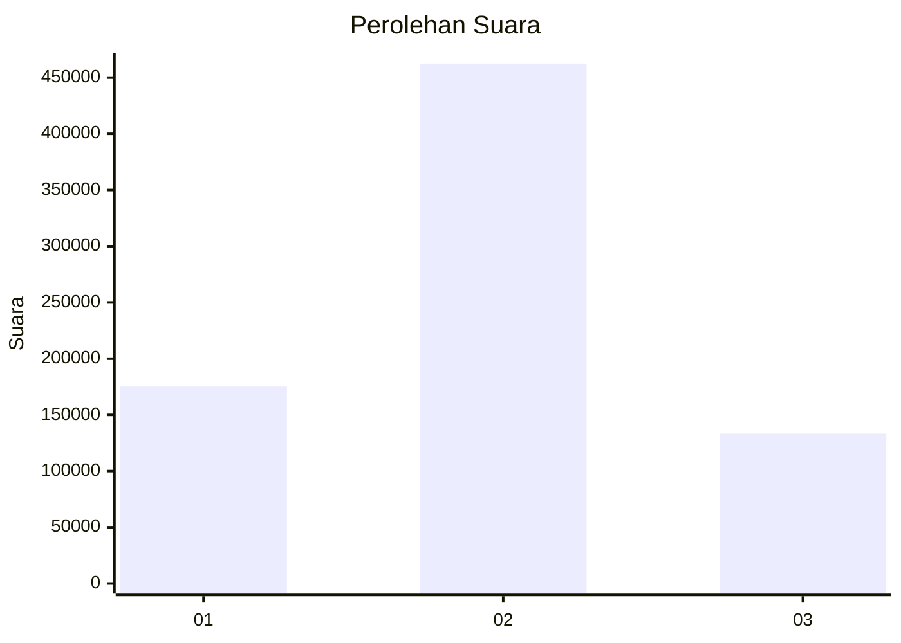
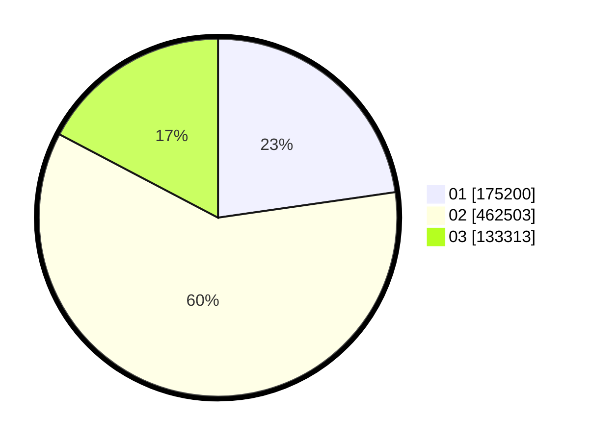

# Hasil

Wilayah **KEPULAUAN BANGKA BELITUNG**

## Grafik

## Tabel

| No. | Nama Paslon    | Suara   | Suara (raw) | Persentase |
|:--- |:-------------- | -------:| -----------:| ----------:|
| 1   | ANIES MUHAIMIN | 175.200 | 175200      | 22,72      |
| 2   | PRABOWO GIBRAN | 462.503 | 462503      | 59,99      |
| 3   | GANJAR MAHFUD  | 133.313 | 133313      | 17,29      |

## Metadata

| Key             | Value   |
| --------------- | ------- |
| Tipe Pemilu     | Reguler |
| Persentase      | 85,93   |
| Status Progress | On      |

