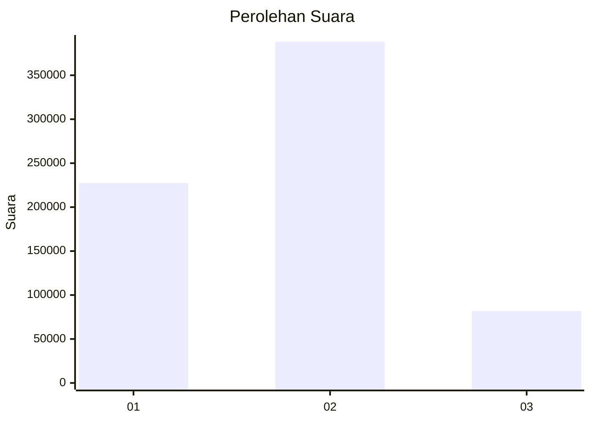
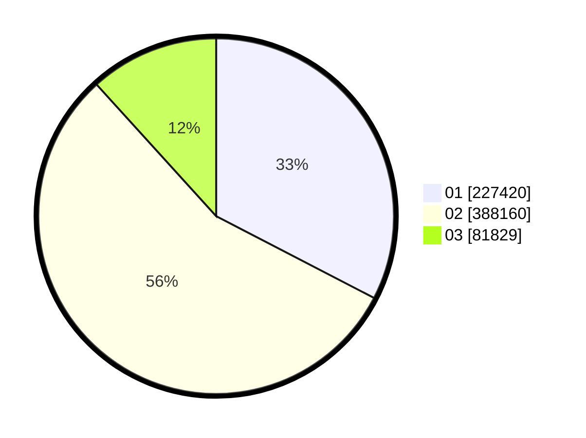

# Hasil

Wilayah **KEPULAUAN RIAU**

## Grafik

## Tabel

| No. | Nama Paslon    | Suara   | Suara (raw) | Persentase |
|:--- |:-------------- | -------:| -----------:| ----------:|
| 1   | ANIES MUHAIMIN | 227.420 | 227420      | 32,61      |
| 2   | PRABOWO GIBRAN | 388.160 | 388160      | 55,66      |
| 3   | GANJAR MAHFUD  | 81.829  | 81829       | 11,73      |

## Metadata

| Key             | Value   |
| --------------- | ------- |
| Tipe Pemilu     | Reguler |
| Persentase      | 59,44   |
| Status Progress | On      |

