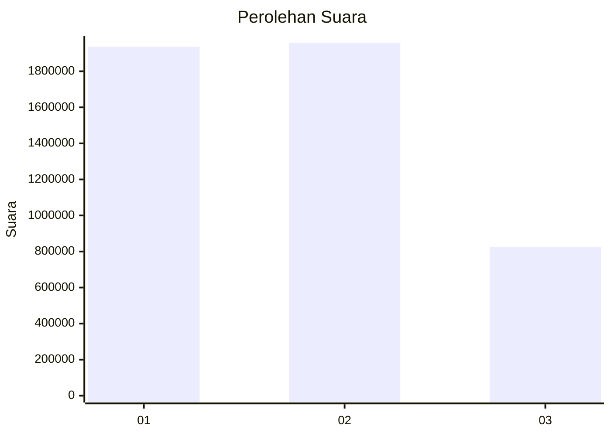
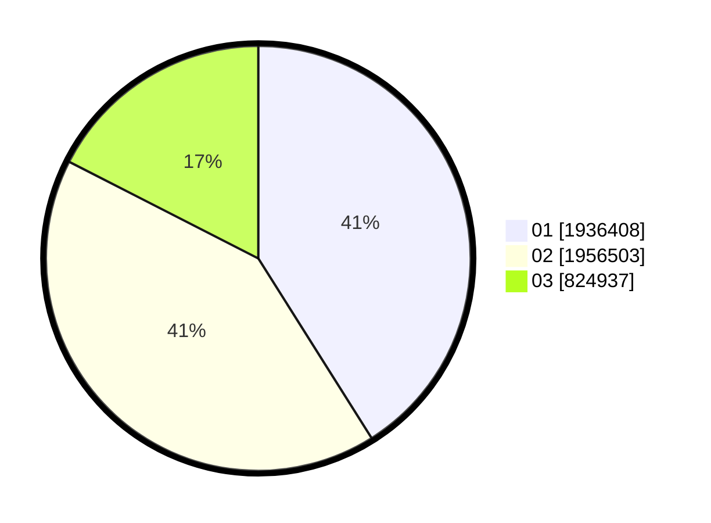

# Hasil

Wilayah **DKI JAKARTA**

## Grafik

## Tabel

| No. | Nama Paslon    | Suara     | Suara (raw) | Persentase |
|:--- |:-------------- | ---------:| -----------:| ----------:|
| 1   | ANIES MUHAIMIN | 1.936.408 | 1936408     | 41,04      |
| 2   | PRABOWO GIBRAN | 1.956.503 | 1956503     | 41,47      |
| 3   | GANJAR MAHFUD  | 824.937   | 824937      | 17,49      |

## Metadata

| Key             | Value   |
| --------------- | ------- |
| Tipe Pemilu     | Reguler |
| Persentase      | 72,14   |
| Status Progress | On      |

