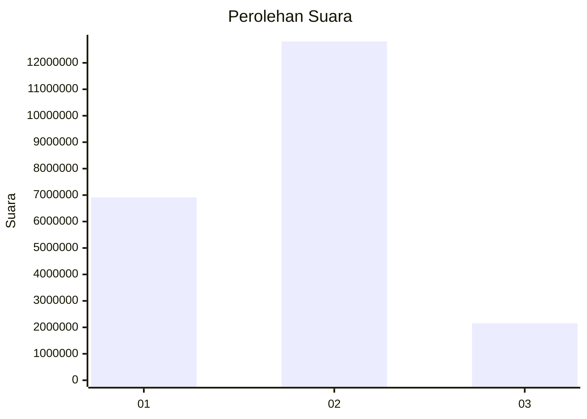

# Hasil

Wilayah **JAWA BARAT**

## Grafik

## Tabel

| No. | Nama Paslon    | Suara      | Suara (raw) | Persentase |
|:--- |:-------------- | ----------:| -----------:| ----------:|
| 1   | ANIES MUHAIMIN | 6.910.499  | 6910499     | 31,60      |
| 2   | PRABOWO GIBRAN | 12.809.346 | 12809346    | 58,57      |
| 3   | GANJAR MAHFUD  | 2.150.063  | 2150063     | 9,83       |

## Metadata

| Key             | Value   |
| --------------- | ------- |
| Tipe Pemilu     | Reguler |
| Persentase      | 75,94   |
| Status Progress | On      |

