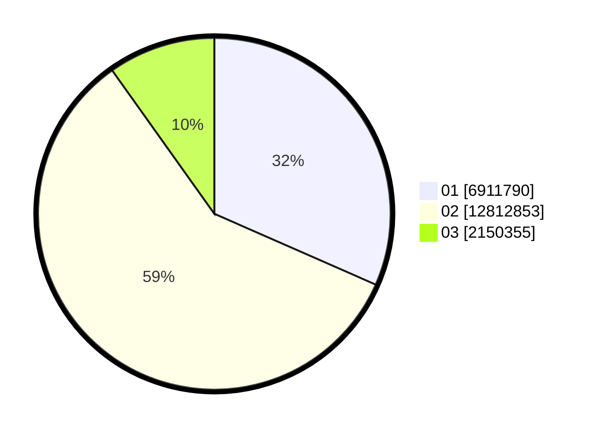

# Hasil

Wilayah **JAWA BARAT**

## Grafik

## Tabel

| No. | Nama Paslon    | Suara      | Suara (raw) | Persentase |
|:--- |:-------------- | ----------:| -----------:| ----------:|
| 1   | ANIES MUHAIMIN | 6.911.790  | 6911790     | 31,60      |
| 2   | PRABOWO GIBRAN | 12.812.853 | 12812853    | 58,57      |
| 3   | GANJAR MAHFUD  | 2.150.355  | 2150355     | 9,83       |

## Metadata

| Key             | Value   |
| --------------- | ------- |
| Tipe Pemilu     | Reguler |
| Persentase      | 75,90   |
| Status Progress | On      |

