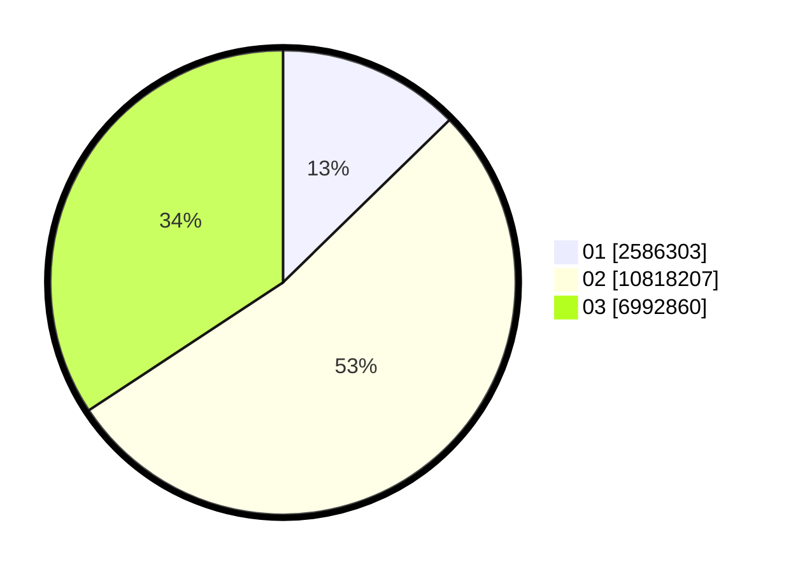

# Hasil

Wilayah **JAWA TENGAH**

## Grafik

## Tabel

| No. | Nama Paslon    | Suara      | Suara (raw) | Persentase |
|:--- |:-------------- | ----------:| -----------:| ----------:|
| 1   | ANIES MUHAIMIN | 2.586.303  | 2586303     | 12,68      |
| 2   | PRABOWO GIBRAN | 10.818.207 | 10818207    | 53,04      |
| 3   | GANJAR MAHFUD  | 6.992.860  | 6992860     | 34,28      |

## Metadata

| Key             | Value   |
| --------------- | ------- |
| Tipe Pemilu     | Reguler |
| Persentase      | 89,58   |
| Status Progress | On      |

