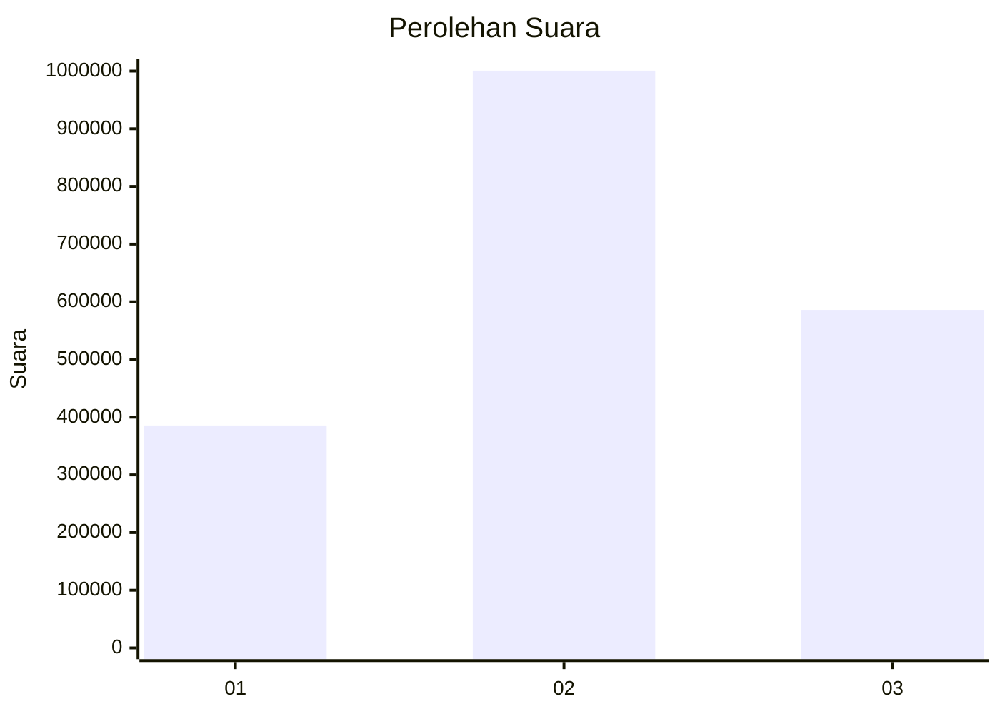
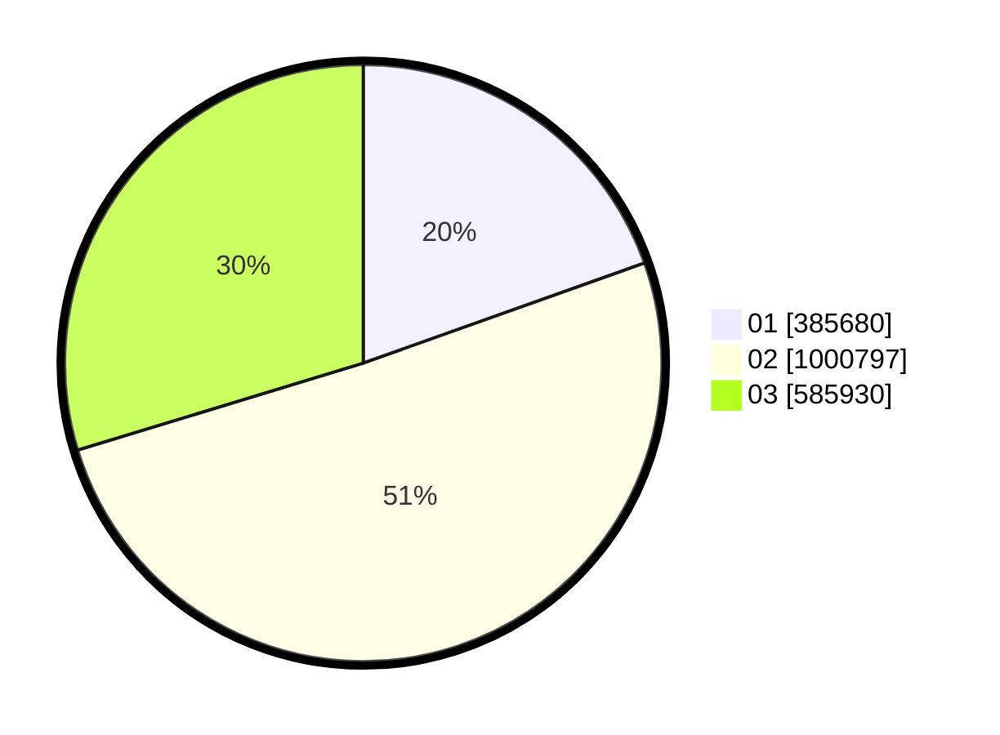

# Hasil

Wilayah **DI YOGYAKARTA**

## Grafik

## Tabel

| No. | Nama Paslon    | Suara     | Suara (raw) | Persentase |
|:--- |:-------------- | ---------:| -----------:| ----------:|
| 1   | ANIES MUHAIMIN | 385.680   | 385680      | 19,55      |
| 2   | PRABOWO GIBRAN | 1.000.797 | 1000797     | 50,74      |
| 3   | GANJAR MAHFUD  | 585.930   | 585930      | 29,71      |

## Metadata

| Key             | Value   |
| --------------- | ------- |
| Tipe Pemilu     | Reguler |
| Persentase      | 78,79   |
| Status Progress | On      |

