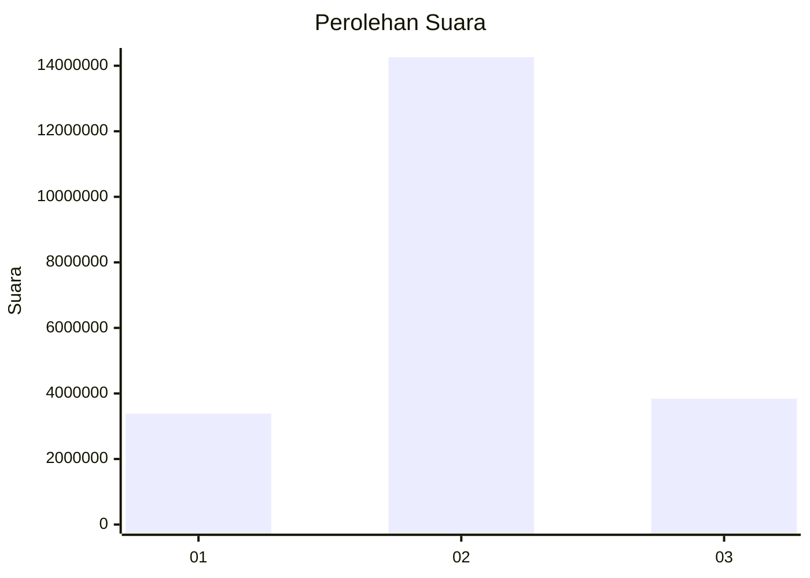

# Hasil

Wilayah **JAWA TIMUR**

## Grafik

## Tabel

| No. | Nama Paslon    | Suara      | Suara (raw) | Persentase |
|:--- |:-------------- | ----------:| -----------:| ----------:|
| 1   | ANIES MUHAIMIN | 3.385.282  | 3385282     | 15,75      |
| 2   | PRABOWO GIBRAN | 14.262.328 | 14262328    | 66,37      |
| 3   | GANJAR MAHFUD  | 3.840.683  | 3840683     | 17,87      |

## Metadata

| Key             | Value   |
| --------------- | ------- |
| Tipe Pemilu     | Reguler |
| Persentase      | 84,43   |
| Status Progress | On      |

