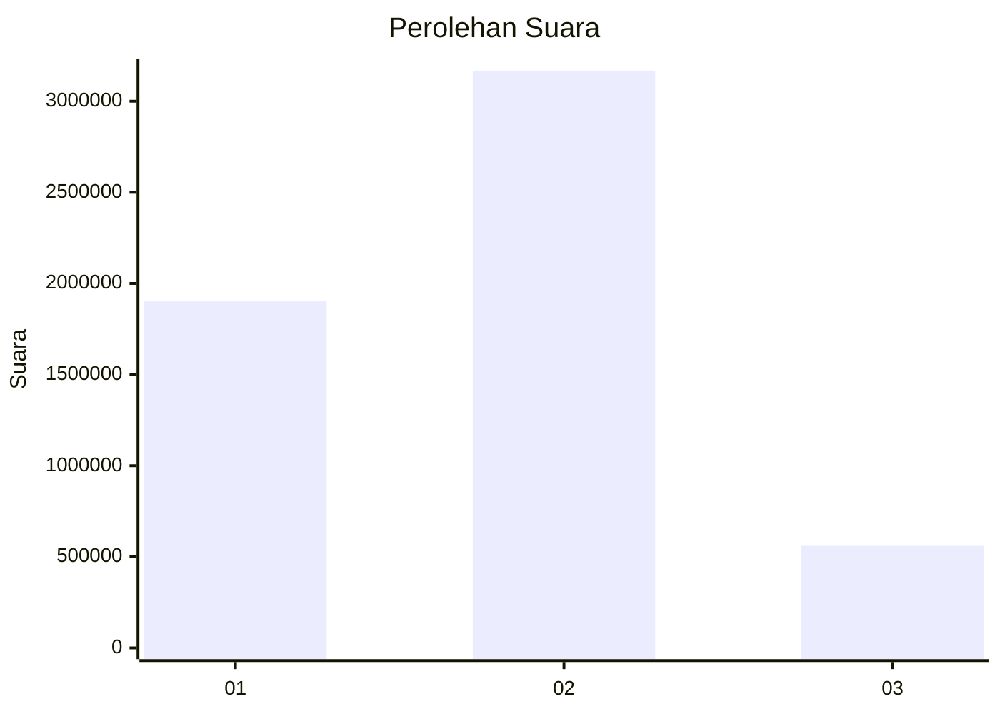
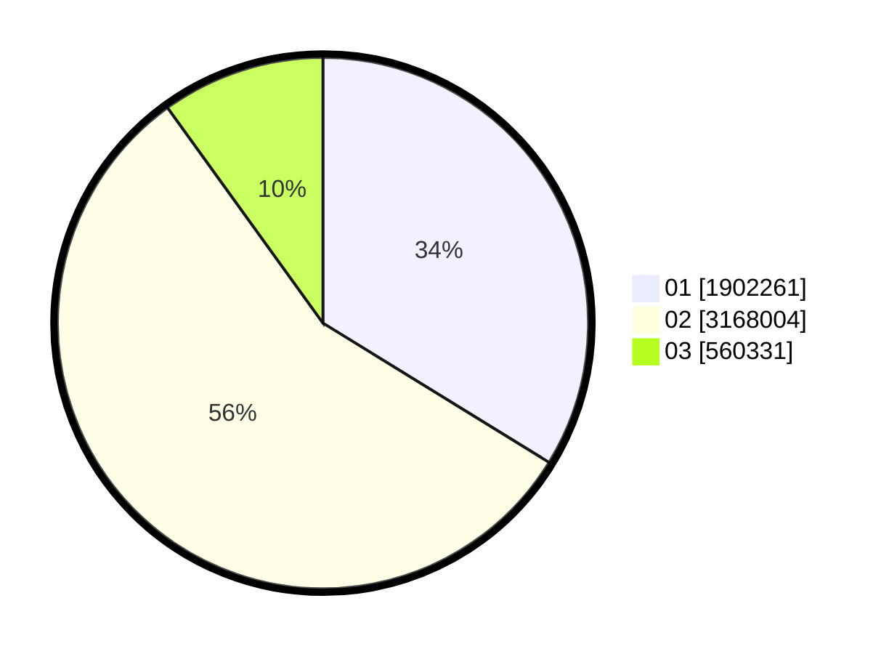

# Hasil

Wilayah **BANTEN**

## Grafik

## Tabel

| No. | Nama Paslon    | Suara     | Suara (raw) | Persentase |
|:--- |:-------------- | ---------:| -----------:| ----------:|
| 1   | ANIES MUHAIMIN | 1.902.261 | 1902261     | 33,78      |
| 2   | PRABOWO GIBRAN | 3.168.004 | 3168004     | 56,26      |
| 3   | GANJAR MAHFUD  | 560.331   | 560331      | 9,95       |

## Metadata

| Key             | Value   |
| --------------- | ------- |
| Tipe Pemilu     | Reguler |
| Persentase      | 80,76   |
| Status Progress | On      |

