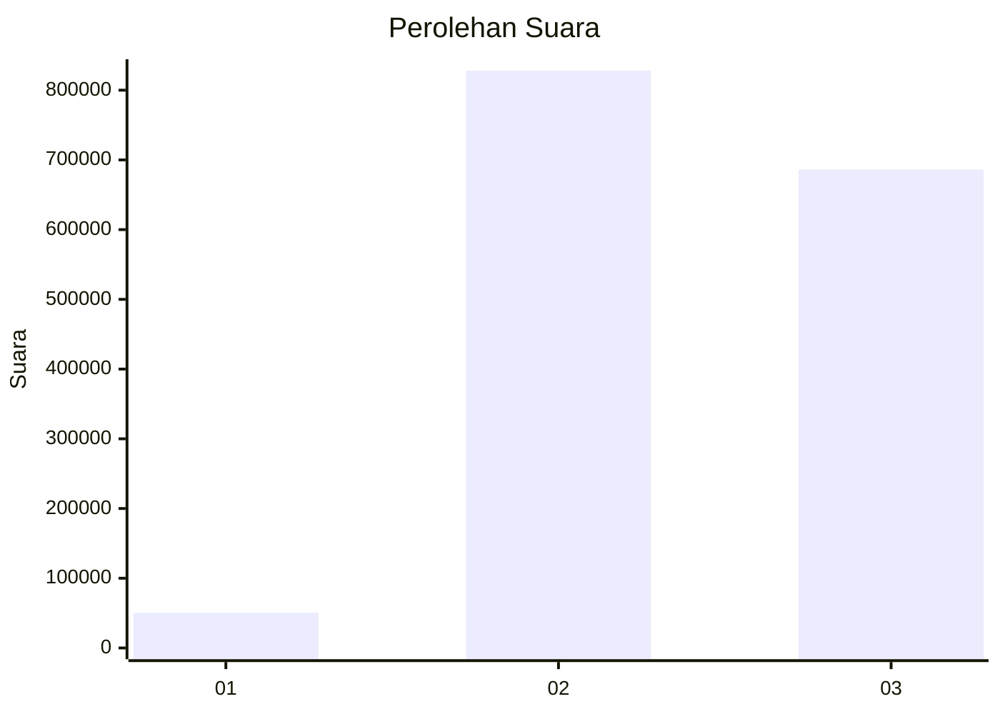
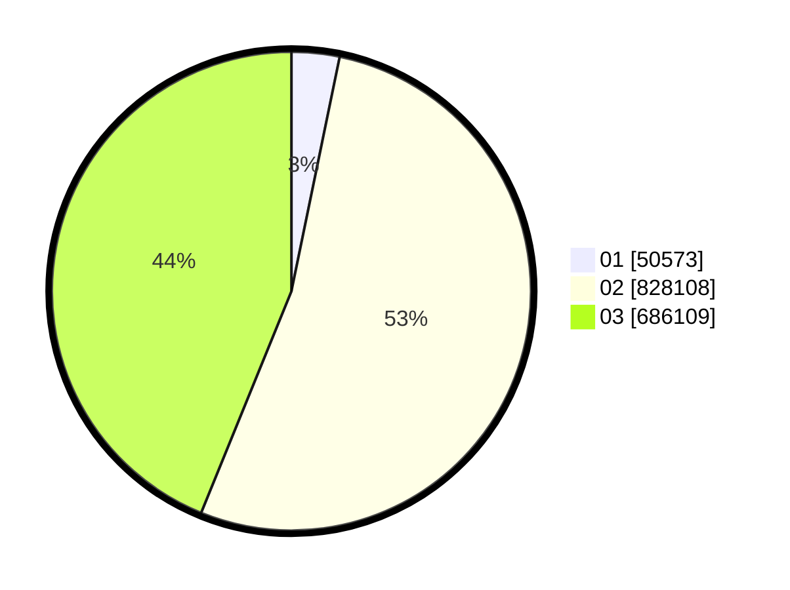

# Hasil

Wilayah **BALI**

## Grafik

## Tabel

| No. | Nama Paslon    | Suara   | Suara (raw) | Persentase |
|:--- |:-------------- | -------:| -----------:| ----------:|
| 1   | ANIES MUHAIMIN | 50.573  | 50573       | 3,23       |
| 2   | PRABOWO GIBRAN | 828.108 | 828108      | 52,92      |
| 3   | GANJAR MAHFUD  | 686.109 | 686109      | 43,85      |

## Metadata

| Key             | Value   |
| --------------- | ------- |
| Tipe Pemilu     | Reguler |
| Persentase      | 56,83   |
| Status Progress | On      |

