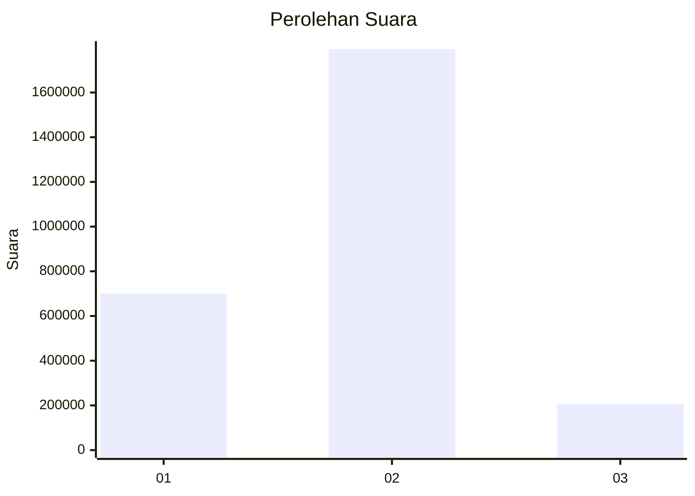

# Hasil

Wilayah **NUSA TENGGARA BARAT**

## Grafik

## Tabel

| No. | Nama Paslon    | Suara     | Suara (raw) | Persentase |
|:--- |:-------------- | ---------:| -----------:| ----------:|
| 1   | ANIES MUHAIMIN | 700.886   | 700886      | 25,93      |
| 2   | PRABOWO GIBRAN | 1.794.504 | 1794504     | 66,38      |
| 3   | GANJAR MAHFUD  | 207.904   | 207904      | 7,69       |

## Metadata

| Key             | Value   |
| --------------- | ------- |
| Tipe Pemilu     | Reguler |
| Persentase      | 89,13   |
| Status Progress | On      |

