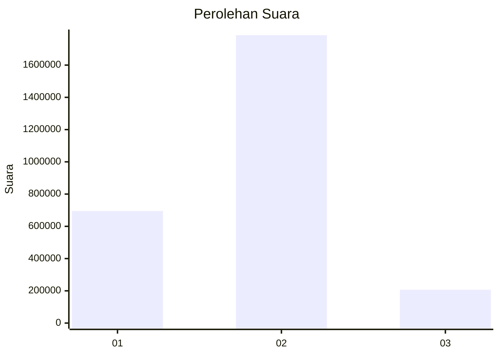

# Hasil

Wilayah **NUSA TENGGARA BARAT**

## Grafik

## Tabel

| No. | Nama Paslon    | Suara     | Suara (raw) | Persentase |
|:--- |:-------------- | ---------:| -----------:| ----------:|
| 1   | ANIES MUHAIMIN | 695.181   | 695181      | 25,86      |
| 2   | PRABOWO GIBRAN | 1.785.473 | 1785473     | 66,43      |
| 3   | GANJAR MAHFUD  | 207.116   | 207116      | 7,71       |

## Metadata

| Key             | Value   |
| --------------- | ------- |
| Tipe Pemilu     | Reguler |
| Persentase      | 83,32   |
| Status Progress | On      |

