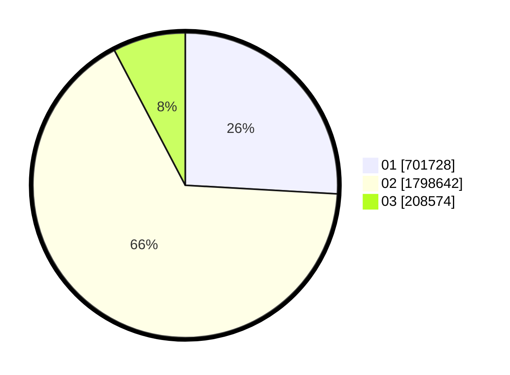

# Hasil

Wilayah **NUSA TENGGARA BARAT**

## Grafik

## Tabel

| No. | Nama Paslon    | Suara     | Suara (raw) | Persentase |
|:--- |:-------------- | ---------:| -----------:| ----------:|
| 1   | ANIES MUHAIMIN | 701.728   | 701728      | 25,90      |
| 2   | PRABOWO GIBRAN | 1.798.642 | 1798642     | 66,40      |
| 3   | GANJAR MAHFUD  | 208.574   | 208574      | 7,70       |

## Metadata

| Key             | Value   |
| --------------- | ------- |
| Tipe Pemilu     | Reguler |
| Persentase      | 87,14   |
| Status Progress | On      |

