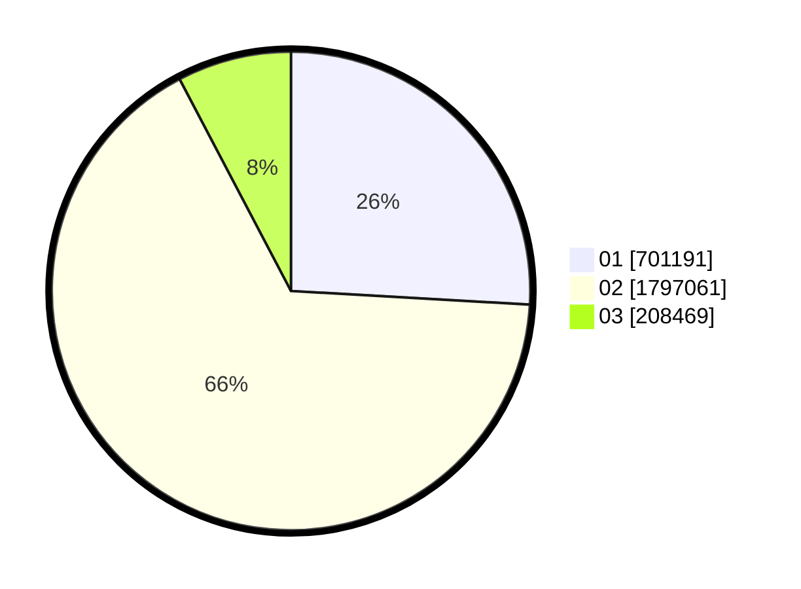

# Hasil

Wilayah **NUSA TENGGARA BARAT**

## Grafik

## Tabel

| No. | Nama Paslon    | Suara     | Suara (raw) | Persentase |
|:--- |:-------------- | ---------:| -----------:| ----------:|
| 1   | ANIES MUHAIMIN | 701.191   | 701191      | 25,91      |
| 2   | PRABOWO GIBRAN | 1.797.061 | 1797061     | 66,39      |
| 3   | GANJAR MAHFUD  | 208.469   | 208469      | 7,70       |

## Metadata

| Key             | Value   |
| --------------- | ------- |
| Tipe Pemilu     | Reguler |
| Persentase      | 87,18   |
| Status Progress | On      |

