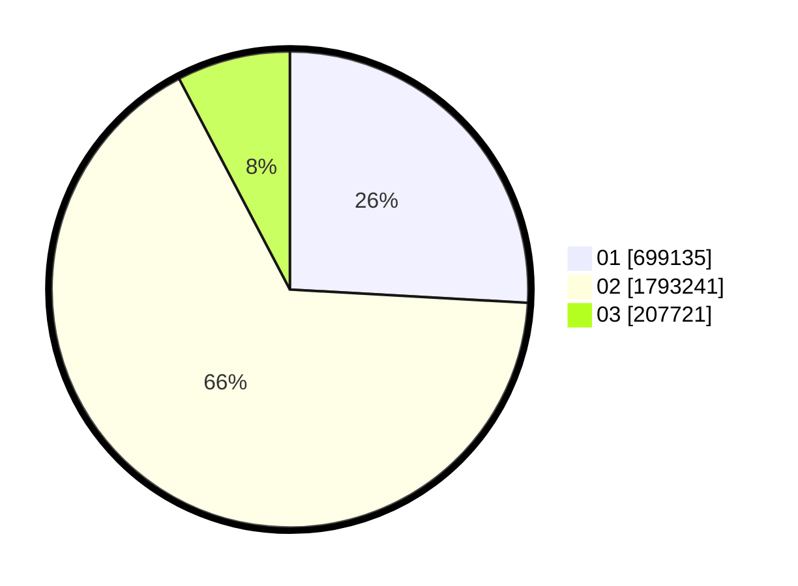

# Hasil

Wilayah **NUSA TENGGARA BARAT**

## Grafik

## Tabel

| No. | Nama Paslon    | Suara     | Suara (raw) | Persentase |
|:--- |:-------------- | ---------:| -----------:| ----------:|
| 1   | ANIES MUHAIMIN | 699.135   | 699135      | 25,89      |
| 2   | PRABOWO GIBRAN | 1.793.241 | 1793241     | 66,41      |
| 3   | GANJAR MAHFUD  | 207.721   | 207721      | 7,69       |

## Metadata

| Key             | Value   |
| --------------- | ------- |
| Tipe Pemilu     | Reguler |
| Persentase      | 85,53   |
| Status Progress | On      |

