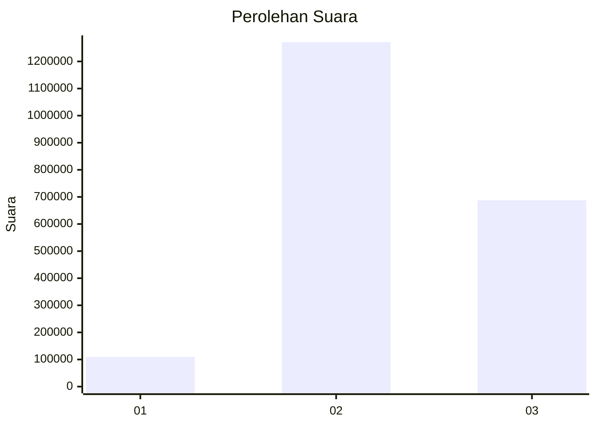
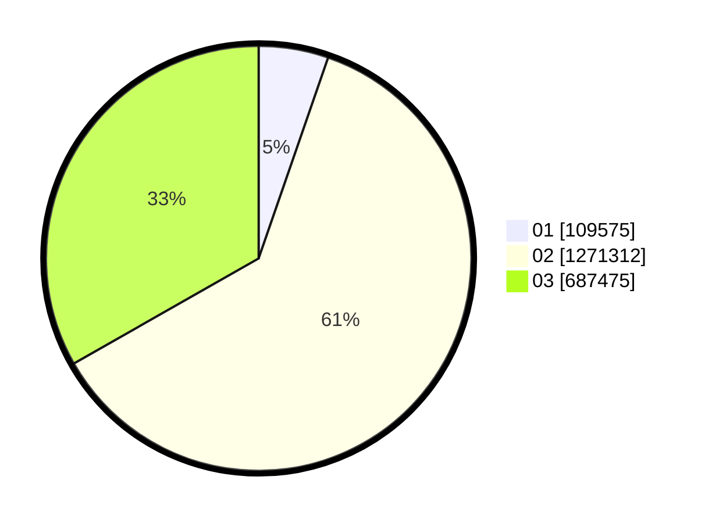

# Hasil

Wilayah **NUSA TENGGARA TIMUR**

## Grafik

## Tabel

| No. | Nama Paslon    | Suara     | Suara (raw) | Persentase |
|:--- |:-------------- | ---------:| -----------:| ----------:|
| 1   | ANIES MUHAIMIN | 109.575   | 109575      | 5,30       |
| 2   | PRABOWO GIBRAN | 1.271.312 | 1271312     | 61,46      |
| 3   | GANJAR MAHFUD  | 687.475   | 687475      | 33,24      |

## Metadata

| Key             | Value   |
| --------------- | ------- |
| Tipe Pemilu     | Reguler |
| Persentase      | 71,52   |
| Status Progress | On      |

