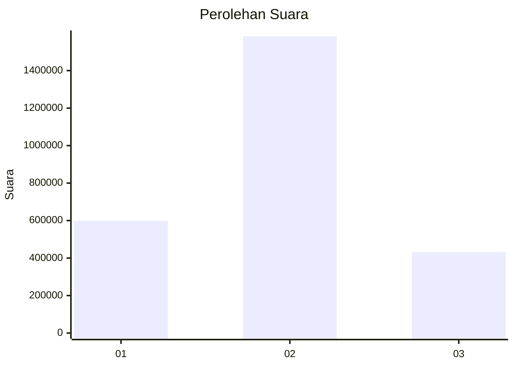
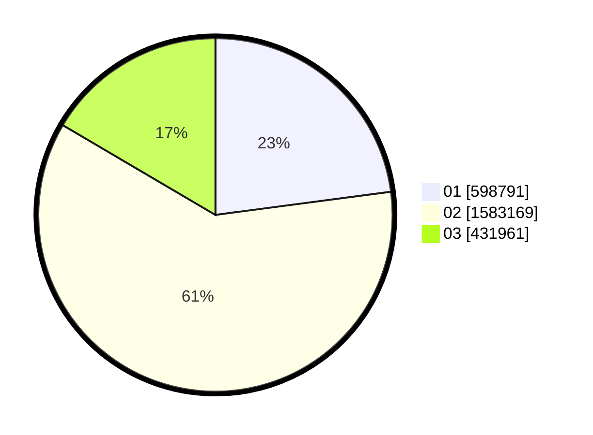

# Hasil

Wilayah **KALIMANTAN BARAT**

## Grafik

## Tabel

| No. | Nama Paslon    | Suara     | Suara (raw) | Persentase |
|:--- |:-------------- | ---------:| -----------:| ----------:|
| 1   | ANIES MUHAIMIN | 598.791   | 598791      | 22,91      |
| 2   | PRABOWO GIBRAN | 1.583.169 | 1583169     | 60,57      |
| 3   | GANJAR MAHFUD  | 431.961   | 431961      | 16,53      |

## Metadata

| Key             | Value   |
| --------------- | ------- |
| Tipe Pemilu     | Reguler |
| Persentase      | 82,66   |
| Status Progress | On      |

