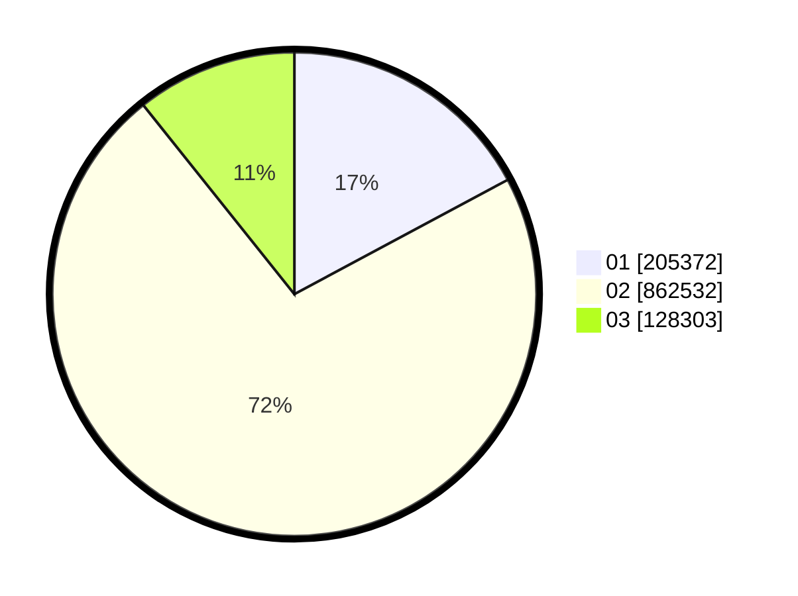

# Hasil

Wilayah **KALIMANTAN TENGAH**

## Grafik

## Tabel

| No. | Nama Paslon    | Suara   | Suara (raw) | Persentase |
|:--- |:-------------- | -------:| -----------:| ----------:|
| 1   | ANIES MUHAIMIN | 205.372 | 205372      | 17,17      |
| 2   | PRABOWO GIBRAN | 862.532 | 862532      | 72,11      |
| 3   | GANJAR MAHFUD  | 128.303 | 128303      | 10,73      |

## Metadata

| Key             | Value   |
| --------------- | ------- |
| Tipe Pemilu     | Reguler |
| Persentase      | 86,07   |
| Status Progress | On      |

