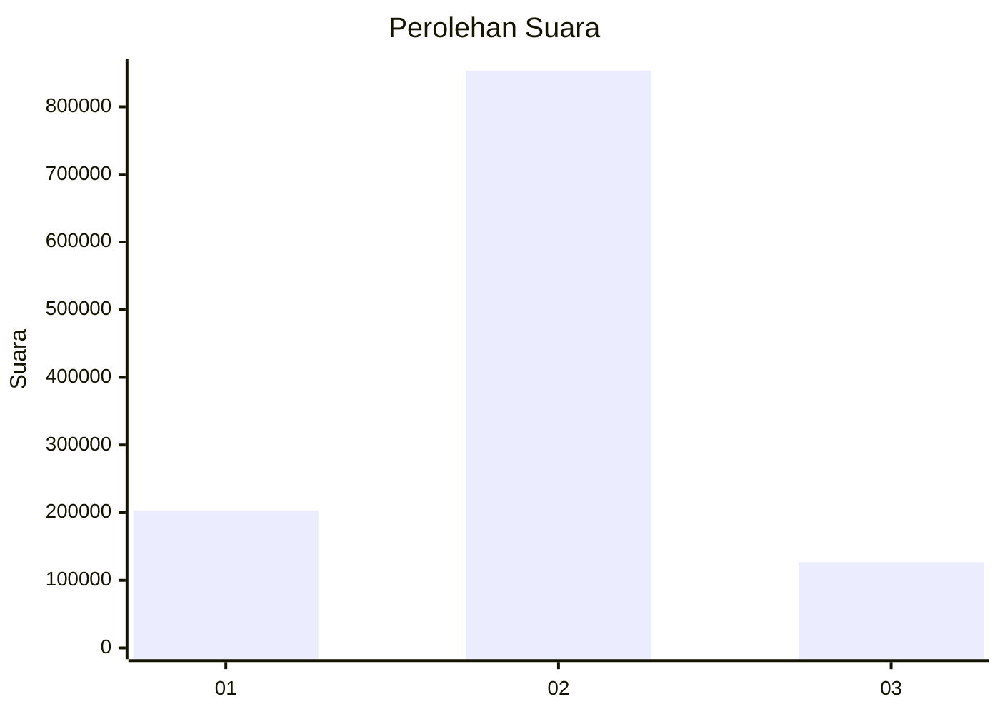

# Hasil

Wilayah **KALIMANTAN TENGAH**

## Grafik

## Tabel

| No. | Nama Paslon    | Suara   | Suara (raw) | Persentase |
|:--- |:-------------- | -------:| -----------:| ----------:|
| 1   | ANIES MUHAIMIN | 203.364 | 203364      | 17,18      |
| 2   | PRABOWO GIBRAN | 853.422 | 853422      | 72,10      |
| 3   | GANJAR MAHFUD  | 126.902 | 126902      | 10,72      |

## Metadata

| Key             | Value   |
| --------------- | ------- |
| Tipe Pemilu     | Reguler |
| Persentase      | 79,81   |
| Status Progress | On      |

