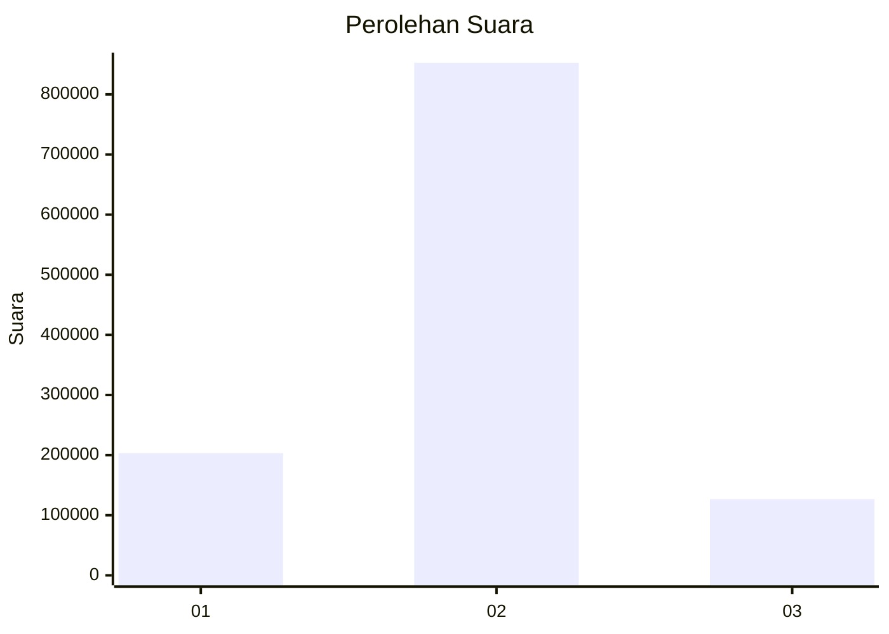

# Hasil

Wilayah **KALIMANTAN TENGAH**

## Grafik

## Tabel

| No. | Nama Paslon    | Suara   | Suara (raw) | Persentase |
|:--- |:-------------- | -------:| -----------:| ----------:|
| 1   | ANIES MUHAIMIN | 203.258 | 203258      | 17,18      |
| 2   | PRABOWO GIBRAN | 852.749 | 852749      | 72,10      |
| 3   | GANJAR MAHFUD  | 126.801 | 126801      | 10,72      |

## Metadata

| Key             | Value   |
| --------------- | ------- |
| Tipe Pemilu     | Reguler |
| Persentase      | 79,13   |
| Status Progress | On      |

