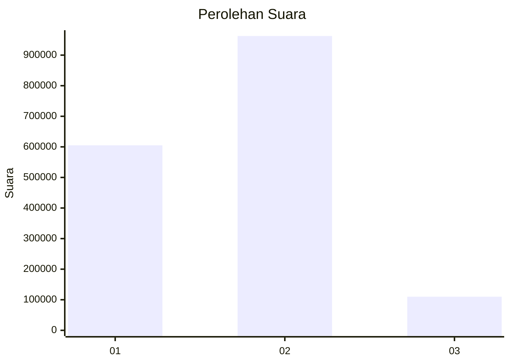
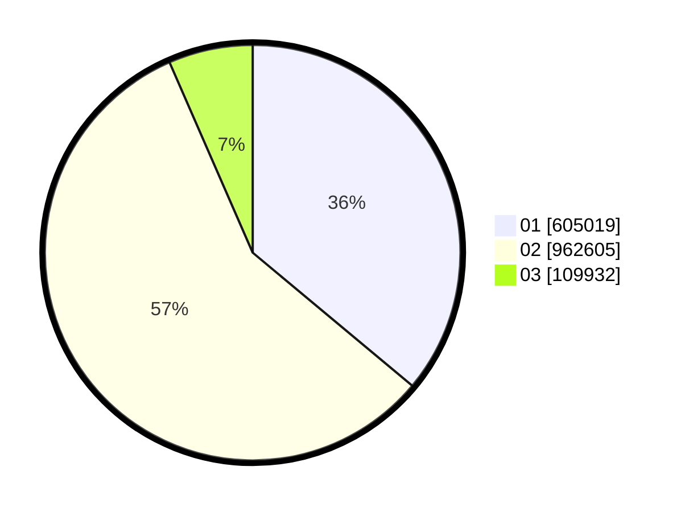

# Hasil

Wilayah **KALIMANTAN SELATAN**

## Grafik

## Tabel

| No. | Nama Paslon    | Suara   | Suara (raw) | Persentase |
|:--- |:-------------- | -------:| -----------:| ----------:|
| 1   | ANIES MUHAIMIN | 605.019 | 605019      | 36,07      |
| 2   | PRABOWO GIBRAN | 962.605 | 962605      | 57,38      |
| 3   | GANJAR MAHFUD  | 109.932 | 109932      | 6,55       |

## Metadata

| Key             | Value   |
| --------------- | ------- |
| Tipe Pemilu     | Reguler |
| Persentase      | 70,52   |
| Status Progress | On      |

