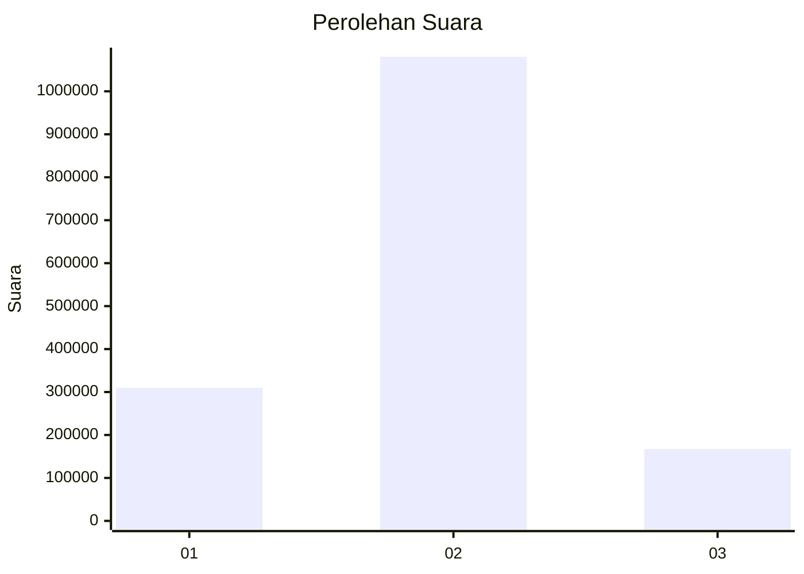
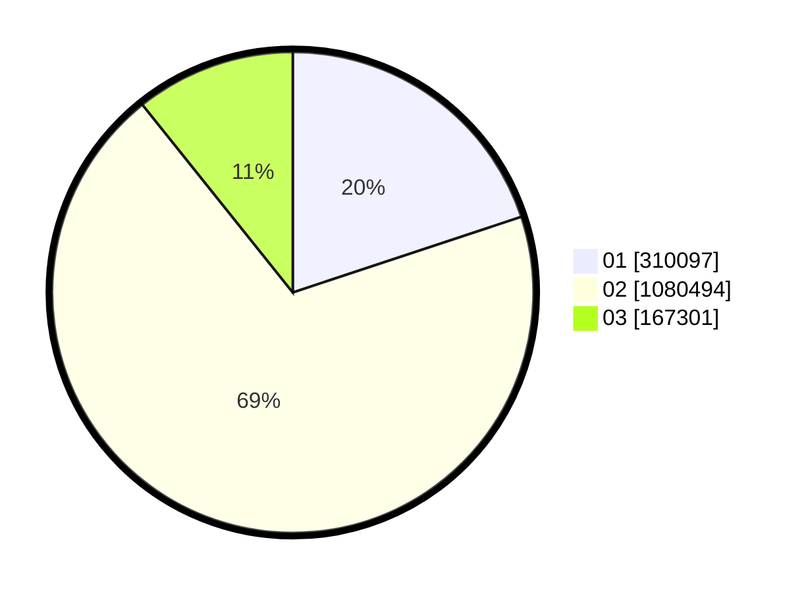

# Hasil

Wilayah **KALIMANTAN TIMUR**

## Grafik

## Tabel

| No. | Nama Paslon    | Suara     | Suara (raw) | Persentase |
|:--- |:-------------- | ---------:| -----------:| ----------:|
| 1   | ANIES MUHAIMIN | 310.097   | 310097      | 19,90      |
| 2   | PRABOWO GIBRAN | 1.080.494 | 1080494     | 69,36      |
| 3   | GANJAR MAHFUD  | 167.301   | 167301      | 10,74      |

## Metadata

| Key             | Value   |
| --------------- | ------- |
| Tipe Pemilu     | Reguler |
| Persentase      | 68,86   |
| Status Progress | On      |

