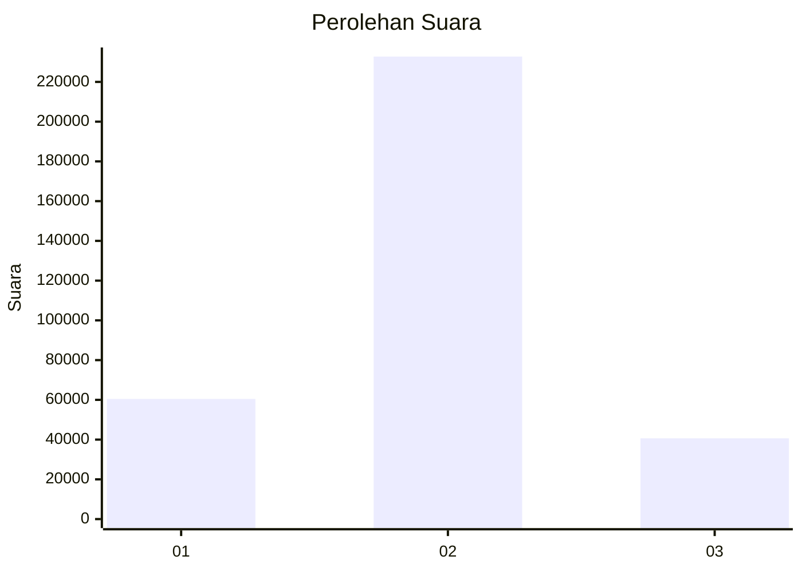
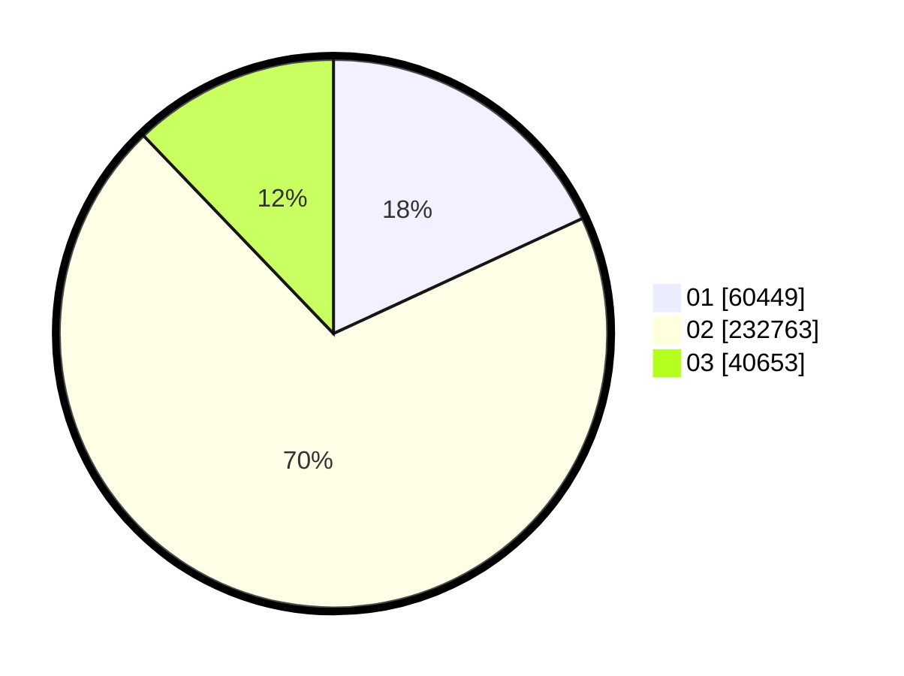

# Hasil

Wilayah **KALIMANTAN UTARA**

## Grafik

## Tabel

| No. | Nama Paslon    | Suara   | Suara (raw) | Persentase |
|:--- |:-------------- | -------:| -----------:| ----------:|
| 1   | ANIES MUHAIMIN | 60.449  | 60449       | 18,11      |
| 2   | PRABOWO GIBRAN | 232.763 | 232763      | 69,72      |
| 3   | GANJAR MAHFUD  | 40.653  | 40653       | 12,18      |

## Metadata

| Key             | Value   |
| --------------- | ------- |
| Tipe Pemilu     | Reguler |
| Persentase      | 80,04   |
| Status Progress | On      |

