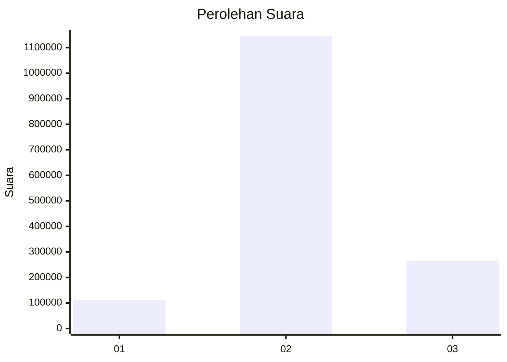
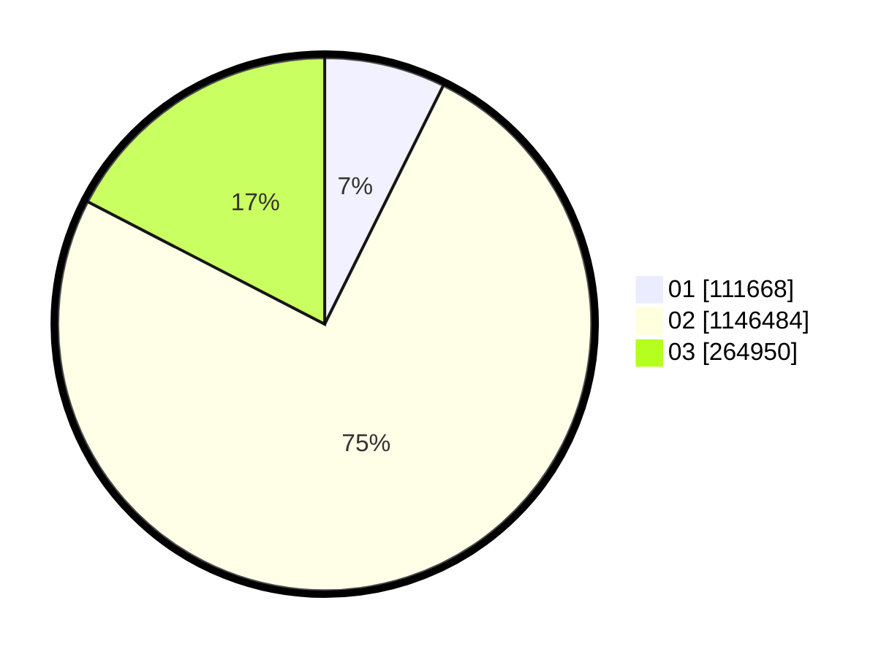

# Hasil

Wilayah **SULAWESI UTARA**

## Grafik

## Tabel

| No. | Nama Paslon    | Suara     | Suara (raw) | Persentase |
|:--- |:-------------- | ---------:| -----------:| ----------:|
| 1   | ANIES MUHAIMIN | 111.668   | 111668      | 7,33       |
| 2   | PRABOWO GIBRAN | 1.146.484 | 1146484     | 75,27      |
| 3   | GANJAR MAHFUD  | 264.950   | 264950      | 17,40      |

## Metadata

| Key             | Value   |
| --------------- | ------- |
| Tipe Pemilu     | Reguler |
| Persentase      | 95,42   |
| Status Progress | On      |

