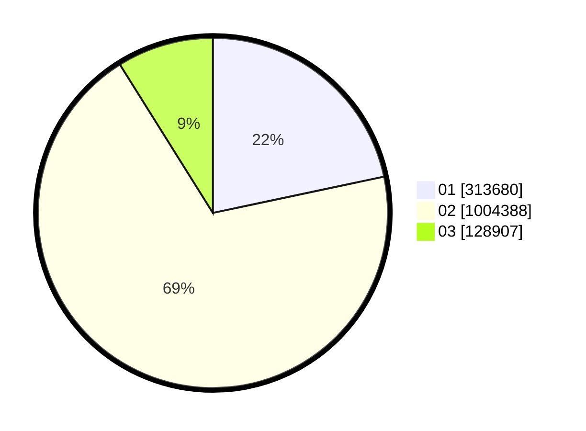

# Hasil

Wilayah **SULAWESI TENGAH**

## Grafik

## Tabel

| No. | Nama Paslon    | Suara     | Suara (raw) | Persentase |
|:--- |:-------------- | ---------:| -----------:| ----------:|
| 1   | ANIES MUHAIMIN | 313.680   | 313680      | 21,68      |
| 2   | PRABOWO GIBRAN | 1.004.388 | 1004388     | 69,41      |
| 3   | GANJAR MAHFUD  | 128.907   | 128907      | 8,91       |

## Metadata

| Key             | Value   |
| --------------- | ------- |
| Tipe Pemilu     | Reguler |
| Persentase      | 84,27   |
| Status Progress | On      |

